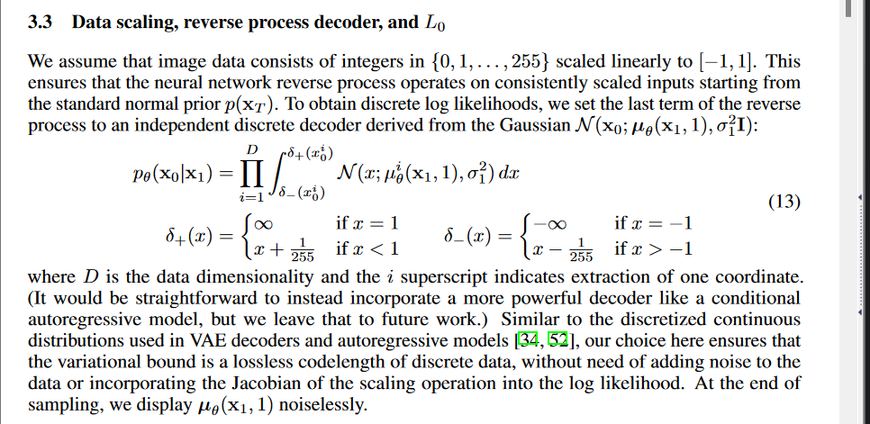
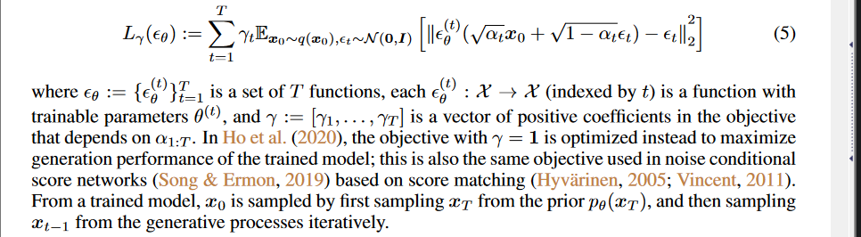
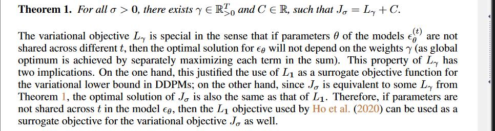

# DDPM

## 有样本 $x_0\sim q(x)$：

## 前向扩散过程， diffusion (q)

以马尔可夫链的方式加噪声，噪声的均值和标准差是由固定的 $\beta_t$ 确定的，随着 t 增大，最终数据分布 $x_T$ 变成一个各项独立的高斯分布。
$$
q(x_{1:T}|x_0) = \prod_{t=1}^Tq(x_t|x_{t-1})
$$

$$
q(x_t|x_{t-1}) = \mathcal{N}(\sqrt{\frac{\alpha_t}{\alpha_{t-1}}}x_{t-1},(1-\frac{\alpha_t}{\alpha_{t-1}})I)
$$

## $q(x_t)$ 推导的特殊性

$$
q(x_t|x_0) = \int{q(x_{1:T}|x_0)dx_{1:(t-1)}} = \mathcal{N}(\sqrt{\alpha_t}x_0,(1-\alpha_t)I)
$$

> 两个正态分布 $x\sim\mathcal{N}(\mu_1,\sigma_1), y\sim\mathcal{N}(\mu_2,\sigma_2)$ 的线性叠加 $ax+by$ 满足均值为 $a\mu_1+b\mu_2$，方差为 $a^2\sigma_1^2+b^2\sigma_2^2$

$$
x_t = \sqrt{\frac{\alpha_t}{\alpha_{t-1}}}x_{t-1}+\sqrt{1-\frac{\alpha_t}{\alpha_{t-1}}}\epsilon_{t-1}
\\=\sqrt{\frac{\alpha_t}{\alpha_{t-2}}}x_{t-2}+\sqrt{\alpha_t-\frac{\alpha_t}{\alpha_{t-2}}}\epsilon_{t-2}+\sqrt{1-\frac{\alpha_t}{\alpha_{t-1}}}\epsilon_{t-1}
\\=\sqrt{\frac{\alpha_t}{\alpha_{t-2}}}x_{t-2}+\sqrt{1-\frac{\alpha_t}{\alpha_{t-2}}}\epsilon_{t-2}
\\...
\\=\sqrt{\alpha_t}x_0+\sqrt{1-\alpha_t}\epsilon,\ \epsilon\sim\mathcal{N}(0,1)
$$

$$
\frac{\alpha_t}{\alpha_{t-1}}_{(DDIM)} = 1-\beta_{t(DDTM)} = \alpha_{t(DDPM)}
,\ \alpha_{T(DDIM)}\rightarrow0,\ \alpha_{0(DDIM)}\rightarrow1
$$

## 逆向去噪过程，denoise (p)

$$
p_{\theta}(x_0) = \int{p_{\theta}(x_{0:T})dx_{1:T}}
$$

$$
p_{\theta}(x_{0:T}) = p_{\theta}(x_T)\prod_{t=1}^Tp_{\theta}^{(t)}(x_{t-1}|x_t)
$$

$$
p_{\theta}^{(t)}(x_{t-1}|x_t) = \mathcal{N}(\mu_{\theta}(x_t,t),\Sigma_{\theta}(x_t,t))
$$

## 后验扩散条件概率 $q(x_{t-1}|x_t,x_0)$

> 高斯分布的概率密度函数 $f(x)=\frac{1}{\sqrt{2\pi\sigma}}e^{-\frac{(x-\mu)^2}{2\sigma^2}}$​

$$
q(x_{t-1}|x_t,x_0) = \mathcal{N}(\widetilde\mu_t(x_t,x_0)+\widetilde\beta_tI)
\\=q(x_{t}|x_{t-1},x_0)\frac{q(x_{t-1}|x_0)}{q(x_t|x_0)}
\\\propto\exp(-\frac{1}{2}(\frac{(x_t-\sqrt{\frac{\alpha_t}{\alpha_{t-1}}}x_{t-1})^2}{1-\frac{\alpha_t}{\alpha_{t-1}}}+\frac{(x_{t-1}-\sqrt{\alpha_{t-1}}x_0)^2}{1-\alpha_{t-1}}-\frac{(x_{t}-\sqrt{\alpha_{t}}x_0)^2}{1-\alpha_{t}}))
\\=\exp(-\frac{1}{2}((\frac{\frac{\alpha_t}{\alpha_{t-1}}}{1-\frac{\alpha_t}{\alpha_{t-1}}}+\frac{1}{1-\alpha_{t-1}})x_{t-1}^2-(\frac{2\sqrt{\frac{\alpha_t}{\alpha_{t-1}}}}{1-\frac{\alpha_t}{\alpha_{t-1}}}x_t+\frac{2\sqrt{\alpha_{t-1}}}{1-\alpha_{t-1}}x_0)x_{t-1})+C(x_t,x_0))
$$

可得 $\widetilde\beta_t=\frac{1-\alpha_{t-1}}{1-\alpha_t}\cdot\beta_{t(DDPM)},\ \widetilde\mu_t=\frac{\sqrt{\frac{\alpha_t}{\alpha_{t-1}}}(1-\alpha_{t-1})}{1-\alpha_t}x_t+\frac{\sqrt{\alpha_{t-1}}\beta_{t(DDPM)}}{1-\alpha_t}x_0=\sqrt\frac{\alpha_{t-1}}{\alpha_{t}}(x_t-\frac{\beta_{t(DDPM)}}{\sqrt{1-\alpha_t}}\epsilon_t)$

## 损失函数推导

$$
\mathbb{E}_q[D_{KL}(q(x_T|x_0)||p(x_T))+\sum_{t>1}D_{KL}(q(x_{t-1}|x_t,x_0)||p_{\theta}(x_{t-1}|x_t))-\log{p_{\theta(x_0|x_1)}}]
$$

各项记为 $L_T,L_{1:T-1},L_0$​，分别表示前向扩散过程、逆向去噪过程以及逆向过程最后一步离散解码器。

1. DDPM 前向过程的 $\beta_t(\alpha_t的表达式)$ 被设置为固定值，及 $L_T$ 为固定值，可忽略。

2. 设计 $\Sigma_{\theta}(x_t,t)=\sigma^2=\beta_t{(DDPM)or\widetilde\beta_t}$​
   $$
   L_{t-1}-C=\mathbb{E}_q[\frac{1}{2\sigma_t^2}||\widetilde\mu_t(x_t,x_0)-\mu_{\theta}(x_t,t)||^2]
   \\=E_{x_0,\epsilon}[\frac{1}{2\sigma_t^2}||\sqrt\frac{\alpha_{t-1}}{\alpha_{t}}(x_t(x_0,\epsilon)-\frac{\beta_{t(DDPM)}}{\sqrt{1-\alpha_t}}\epsilon_t)-\mu_{\theta}(x_t(x_0,\epsilon),t)||^2]
   $$
   将模型预测目标为估计 $\mu_{\theta}$ 以预测 $\widetilde\mu_t$。

   由于逆向过程中，$x_t$ 作为输入已知，设计 $\mu_{\theta}(x_t,t)=\sqrt\frac{\alpha_{t-1}}{\alpha_{t}}(x_t-\frac{\beta_{t(DDPM)}}{\sqrt{1-\alpha_t}}\epsilon_{\theta}(x_t,t))$，
   $$
   L_{t-1}=E_{x_0,\epsilon}[\frac{(1-\frac{\alpha_t}{\alpha_{t-1}})^2}{2\frac{\alpha_t}{\alpha_{t-1}}\sigma_t^2(1-\alpha_t)}||\epsilon-\epsilon_{\theta}(\sqrt{\alpha_t}x_0+\sqrt{1-\alpha_t}\epsilon,t)^2||
   $$
   将模型预测目标转换为从 $x_t$ 预测噪声 $\epsilon$​。

   ---

   $$
   x_{t-1} = \sqrt\frac{\alpha_{t-1}}{\alpha_{t}}(x_t-\frac{\beta_{t(DDPM)}}{\sqrt{1-\alpha_t}}\epsilon_{\theta}(x_t,t))+\sigma_tz\ where\ z\sim\mathcal{N}(0.I)
   $$

   

3. 

# DDIM

损失函数的推导与 $q(x_{1:T}|x_0)$ 的具体形式，而是依赖于 $q(x_t|x_0)$，在 DDPM 中，马尔可夫性质认为 $q(x_t|x_{t-1},x_0) = q(x_t|x_{t-1})$，只要保持 $q(x_t|x_0)$​ 的形式不变，直接复用训练好的 DDPM，设计一个新的概率分布进行逆采样。

## 前向扩散过程，diffusion (q)

定义一种非马尔可夫的前向扩散过程
$$
q_{\sigma}(x_{1:T}|x_0) = q_{\sigma}(x_T|x_0)\prod_{t=2}^Tq_{\sigma}(x_{t-1}|x_t,x_0)
$$

$$
q_{\sigma}(x_T|x_0) = \mathcal{N}(\sqrt{\alpha_T}x_0,(1-\alpha_T)I
$$

$$
q_{\sigma}(x_{t-1}|x_t,x_0) = \mathcal{N}(\sqrt{\alpha_{t-1}}x_0+\sqrt{1-\alpha_{t-1}-\sigma_t^2}\cdot\frac{x_t-\sqrt{\alpha_t}x_0}{\sqrt{1-\alpha_t}},\sigma_t^2I)
$$

$q_{\sigma}(x_{t}|x_{t-1},x_0)$ 可由贝叶斯公式求得。

如此选择以保证：$q_{\sigma}(x_t|x_0) = \mathcal{N}(\sqrt{\alpha_t}x_0,(1-\alpha_t)I$，上式与 $\sigma$ 有关。

## 参考视频和论文

https://www.bilibili.com/video/BV1JY4y1N7dn/?spm_id_from=333.1007.top_right_bar_window_history.content.click&vd_source=5d843fd1b40b968986bd0e262b5719c6

## 逆向去噪过程，denoise (p)

给定 $x_0\sim q(x_0), \epsilon_t\sim\mathcal{N}(0,I)$，可计算 $x_t$，并计算可得 t 时刻的去噪观测量，如下所示
$$
f_{\theta}^{(t)}(x_t) = (x_t-\sqrt{1-\alpha_t}\cdot\epsilon_{\theta}^{(t)}(x_t))/\sqrt{\alpha_t}
$$
定义逆向去噪过程
$$
p_{\theta}^{(t)}(x_{t-1}|x_t) = \left\{
\begin{matrix}
 \mathcal{N}(f_{\theta}^{(1)}(x_1),\sigma_1^2I)\ when\ t=1
 \\q_{\sigma}(x_{t-1}|x_t,f_{\theta}^{(t)}(x_t))
\end{matrix}
\right.
$$

## 损失函数

$$
J_{\sigma}(\epsilon_{\theta}) = \mathbb{E}_{x_0:T\sim q_{\sigma}(x_{0:T})}[\log{q_{\sigma}(x_T|x_0)}+\sum_{t=2}^T\log{q_{\sigma}(x_{t-1}|x_t,x_0)-\sum_{t=1}^T\log{p_{\theta}^{(t)}(x_{t-1}|x_t)-\log{p_{\theta}(x_T)}}}]
$$

---

$$
x_{t-1} = \sqrt{\alpha_{t-1}}(\frac{x_t-\sqrt{1-\alpha_t}\epsilon_{\theta}^{(t)}(x_t)}{\sqrt{\alpha_t}})+\sqrt{1-\alpha_{t-1}-\sigma_t^2}\cdot\epsilon_{\theta}^{(t)}(x_t)+\sigma_t\epsilon_t
$$

当 $\sigma_t=\sqrt{(1-\alpha_{t-1})/(1-\alpha_t)}\sqrt{1-\alpha_t/\alpha_{t-1}}$ 时该过程是马尔科夫的，与 DDPM 相同。

## 加速生成过程

原则上，这意味着我们可以用任意数量的前向步骤来训练模型，但在生成过程中只对其中的部分步骤进行采样。
