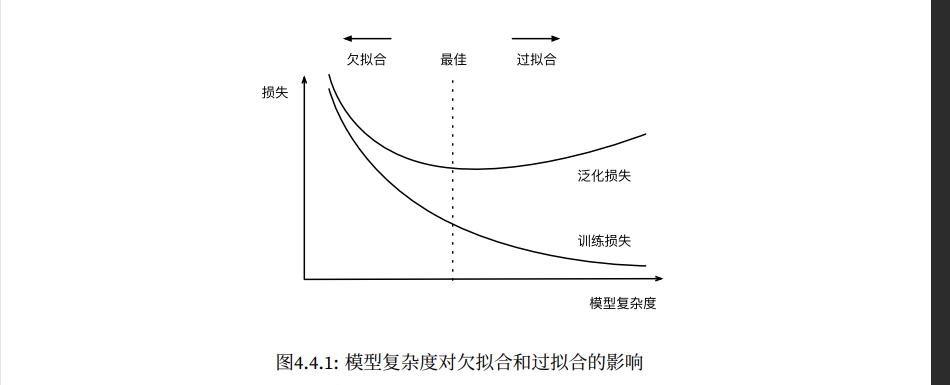

| *PyTorch 神经网络学习笔记* |
| -------------------------- |

# 范数

范数听起来很像距离的度量。欧几里得距离和毕达哥拉斯定理中的非负性概念和三角不等式可能会给出一些启发。事实上，欧几里得距离是一个 $L_2$​ 范数：
$$
\vert\vert\mathbf{x}\vert\vert_2=\sqrt{\sum_{i=1}^{n}{x
_i^2}}
$$

```python
u = torch.tensor([3.0, -4.0])
torch.norm(u)
```

$L_1$​ 范数，它表示为向量元素的绝对值之和：
$$
\vert\vert\mathbf{x}\vert\vert_1=\sum_{i=1}^{n}{\vert x
_i\vert}
$$
以上都是更一般的 $L_p$​ 范数的特例：
$$
\vert\vert\mathbf{x}\vert\vert_p=(\sum_{i=1}^{n}{{\vert x
_i\vert}^p})^{1/p}
$$
类似的，矩阵 $\mathbf{X}\in\mathbb{R}^{n \times d}$​ 的 Frobenius 范数是矩阵元素的平方和的平方根：
$$
\vert\vert\mathbf{X}\vert\vert_F=\sqrt{\sum_{i=1}^{m}\sum_{j=1}^{n}x_{ij}^2}
$$

# 线性神经网络

## 线性回归

所有特征为向量 $\mathbf{x}\in\mathbb{R}^d$，所有权重为向量 $\mathbf{w}\in\mathbb{R}^d$​，用点积形式来简洁地表达模型：
$$
\hat{y}=\mathbf{w}^T\mathbf{x}+b
$$
对于整个数据集的 n 个样本，有 $\mathbf{X}\in\mathbb{R}^{n \times d}$，每一行是一个样本，每一列是一种特征。$\hat{y}\in\mathbb{R}^n$

通过矩阵向量乘积表示：
$$
\hat{y}=\mathbf{X}\mathbf{w}+b
$$

### 损失函数

希望寻找一组参数 $(\mathbf{w}^*,b^*)$​ 最小化所有训练样本的总损失：
$$
\mathbf{w}^*,b^*={\underset{\mathbf{w},b}{\arg\min}\ L(\mathbf{w},b)}
$$

#### 正态分布和平方损失

随机变量 $x$ 具有均值 $\mu$ 和方差 $\sigma^2$​，正态分布表示为：
$$
p(x)=\frac{1}{\sqrt{2\pi\sigma^2}}\exp{(-\frac{1}{2\sigma^2}(x-\mu)^2)}
$$

```python
def normal(x, mu, sigma):
    p = 1 / math.sqrt(2 * math.pi * sigma**2)
    return p * np.exp(-0.5 / sigma**2 * (x - mu)**2)
```

均方误差损失函数可以用于线性回归的一个原因是：假设了观测中包含噪声，其中噪声服从正态分布 $\epsilon\sim\mathcal{N}(0,\sigma^2)$​。
$$
y=\mathbf{w}^T\mathbf{x}+b+\epsilon
$$
可以写出通过给定的 $\mathbf{x}$ 观测到特定 $y$​ 的似然：
$$
p(y\vert x)=\frac{1}{\sqrt{2\pi\sigma^2}}\exp{(-\frac{1}{2\sigma^2}(y-\mathbf{w}^T\mathbf{x}-b)^2)}
$$
根据极大似然估计法，参数 $\mathbf{w},b$​ 的最优值是使整个数据集的似然最大的值：
$$
P(y\vert x)=\prod_{i=1}^{n}p(y^{(i)}\vert x^{(i)})
$$

$$
-\log{P(y\vert x)}=\sum_{i=1}^{n}\frac{1}{2}\log{2\pi\sigma^2}+\frac{1}{2\sigma^2}(y-\mathbf{w}^T\mathbf{x}-b)^2
$$

```python
def squared_loss(y_hat, y):
    """均方损失"""
    return (y_hat - y.reshape(y_hat.shape)) ** 2 / 2
# loss = nn.MSELoss(reduction='none')
```

常数 $\frac{1}{2}$ 不会带来本质的差别，但是有利于计算导数后系数为 1。

### ==随机梯度下降==

通常会在每次需要计算更新的时候随机抽取一小批样本，这种变体叫做小批量随机梯度下降，随机抽样一个小批量 $\mathcal{B}$，计算小批 量的平均损失关于模型参数的导数，将梯度乘以一个预先确定的正数 $\eta$，并从 当前参数的值中减掉：
$$
(\mathbf{w},b)\leftarrow(\mathbf{w},b)-\frac{\eta}{\vert\mathcal{B}\vert}{\sum\limits_{i\in\mathcal{B}}}\partial_{(\mathbf{w},b)}l^{(i)}(\mathbf{w},b)
$$

```python
def sgd(params, lr, batch_size):
"""小批量随机梯度下降"""
    with torch.no_grad():
        for param in params:
            param -= lr * param.grad / batch_size
            param.grad.zero_()
```

> *一般在训练之前权重参数生成为一个具有正态分布的随机数组。*

## softmax 回归


***softmax 函数能够将未规范化的预测变换为非负数并且总和为 1，同时让模型保持可导。***
$$
\hat{y}=softmax(\mathbf{o}),\ \hat{y_j}=\frac{\exp{o_j}}{\sum_k{\exp{o_k}}}
$$
***对比hardmax，softmax不再唯一的确定某一个最大值，而是为每个输出分类的结果都赋予一个概率值，表示属于每个类别的可能性。***

小批量样本特征 $\mathbf{X}\in\mathbb{R}^{n \times d}$ ，权重 $\mathbf{W}\in\mathbb{R}^{n \times d}$ ，偏执 $\mathbf{b}\in\mathbb{	R}^{1\times q}$，softmax 回归的矢量计算表达式为：
$$
\mathbf{O}=\mathbf{X}\mathbf{W}+\mathbf{b}
$$

$$
\mathbf{\hat{Y}}=softmax(\mathbf{O})
$$

### 交叉熵损失函数

> *和 softmax 一同使用？*
>
> *在计算 $\exp{o_k}$ 时可能出现上溢（overflow），若通过统一减去一个常数如 $\max{(o_k)}$来限制（对每个 $o_k$ 按一个常数位移不改变 softmax 的结果），由于 $o_j-\max{(o_k)}$​ 可能是较大负值，而其 exp 指数将接近零而被四舍五入出现下溢（underflow），并使得其对数为负无穷大*
>
> *softmax 与交叉熵一同使用即可在取对数和求 exp 指数抵消*

$$
l(\mathbf{y},\mathbf{\hat{y}})=-\sum_{j=1}^{q}y_j\log{\hat{y_j}}\\
=\log{\sum_{k=1}^q\exp{o_k}}-\sum_{j=1}^qy_jo_j
$$

$$
\partial_{o_j}l(\mathbf{y},\mathbf{\hat{y}})=\frac{\exp{o_j}}{\sum_{k=1}^q{\exp{o_k}}}=softmax(o)_j-y_j
$$

信息论的核心思想是量化数据中的信息内容。在信息论中，该数值被称为分布 $P$​ 的熵。可以通过 以下方程得到：
$$
H[P]=\sum_j{-P(j)\log{P(j)}}
$$
们可以把交叉熵想象为“主观概率为 $Q$ 的观察者在看到根据概率 $P$​ 生成的数据时的预期惊异”。

从两方面来考虑交叉熵分类目标：

- 最大化观测数据的似然
- 最小化传达标签所需的惊异

```python
def cross_entropy(y_hat, y):
    """交叉熵损失"""
	return - torch.log(y_hat[range(len(y_hat)), y])
```

### softmin？


# 多层感知机（multilayer perceptron, MLP）

> *仿射变换的仿射变换仍是仿射变换，简单通过多层线性全连接层增加层数是无效的。*
>
> *在仿射变换之后对每个隐藏单元应用非线性的激活函数 $\sigma$，即可避免多层感知机退化为线性模型。*
>
> 

> *虽然一个单隐层网络能学习任何函数，但并不意味着我们应该尝试使用单隐藏层网络来解决所有问题。事实上，通过使用更深（而不是更广）的网络，我们可以更容易地逼近许多函数。*

## ==激活函数==

> *[激活函数.md](激活函数.md)* 

##  模型选择、过拟合、欠拟合

### 模型的训练误差、泛化误差

- 训练误差是指，模型在训练数据集上计算得到的误差。
- 泛化误差模型应用在同样从原始样本的分布中抽取的==无限多==数据样本时，模型误差的期望。

### 几个倾向于影响模型泛化的因素：

- 当可调整参数的数量（有时称为自由度）很大时，模型往往更容易过拟合。
- 当权重的取值范围较大时，模型可能更容易过拟合。
- 即使模型很简单，也很容易过拟合只包含一两个样本的数据集。而过拟合一个有数百 万个样本的数据集则需要一个极其灵活的模型。

### K 折交叉验证（K-fold Cross Validation）

原始训练数据被分成K个不重叠的子集。然后执行 K 次模型训练和验证， 每次在 K − 1 个子集上进行训练，并在剩余的一个子集（在该轮中没有用于训练的子集）上进行验证。最后， 通过对 K 次实验的结果取平均来估计训练和验证误差。



## 权重衰减

解决模型过拟合的正则化方法之一,通常也被 称为 $L_2$ 正则化。

一种简单的方法是通过线性函数中的权重向量的某个范数来度量其复杂性，例如 $\vert\vert\mathbf{w}\vert\vert^2$​​。要保证 权重向量比较小，最常用方法是将其范数作为惩罚项加到最小化损失的问题中。将原来的训练目标最小化训练标签上的预测损失，调整为最小化预测损失和惩罚项之和。

为了平衡这个新的额外惩罚的损失，引入正则化常数 $\lambda$，这是一个非负超参数。
$$
L(\mathbf{w},b)+\frac{\lambda}{2}\vert\vert\mathbf{w}\vert\vert^2
$$


> *岭回归：`https://blog.csdn.net/weixin_44225602/article/details/112912067`*

此时 $L_2$ 正则化回归的小批量随机梯度下降更新如下：
$$
\mathbf{w}\leftarrow(1-\eta\lambda)\mathbf{w}-\frac{\eta}{\vert\mathcal{B}\vert}\sum_{i\in\mathcal{B}}\mathbf{x}^{(i)}(\mathbf{w}^T\mathbf{x}^{(i)}+b-y^{(i)})
$$
是否对相应的偏置进行惩罚在不同的实践中会有所不同，在神经网络的不同层中也会有所不同。通常，网络输出层的偏置项不会被正则化。

```python
trainer = torch.optim.SGD([
    {"params":net[0].weight,'weight_decay': wd},
    {"params":net[0].bias}], lr=lr)
```

## 暂退法（Dropout）

> *泛化性和灵活性之间的这种基本权衡被描述为==偏差-方差==权衡（bias‐variance tradeoff）。*
>
> *线性模型有很高的偏差：它们只能表示一小类函数。然而，这些模型的方差很低：它们在不同的随机数据样本上可以得出相似的结果。*
>
> *深度神经网络位于偏差‐方差谱的另一端。与线性模型不同，神经网络并不局限于单独查看每个特征，而是学 习特征之间的交互。*

经典泛化理论认为，为了缩小训练和测试性能之间的差距，应该以简单的模型为目标。简单性包括：

- 较小的维度
- 参数的范数

简单性的另一个角度是平滑性，即函数不应该对其输入的微小变化敏感。

在==标准暂退法正则化==中，未丢弃的节点的分数进行规范化来消除每一层的偏差。每个中间活性值 h 以暂退概率 p 计算并替代，如下所示：
$$
h'=\left\{
\begin{matrix}
 0,\ 概率为p \\
 \frac{h}{1-p},\ 其他情况 
\end{matrix}
\right.
$$

```python
net = nn.Sequential(nn.Flatten(),
    nn.Linear(784, 256),
    nn.ReLU(),
    # 在第一个全连接层之后添加一个dropout层
    nn.Dropout(dropout1),
    nn.Linear(256, 256),
    nn.ReLU(),
    # 在第二个全连接层之后添加一个dropout层
    nn.Dropout(dropout2),
    nn.Linear(256, 10))
```

在训练时，Dropout 层将根据指定的暂退概率随机丢弃上一层的输出（相当于下一层的输入）。在测试时，Dropout 层仅传递数据。

## 前向传播、反向传播和计算图


> *在这里，我们使用 prod 运算符在执行必要的操作（如换位和交换输入位置）后将其参数相乘。对于向量，这 很简单，它只是矩阵‐矩阵乘法。对于高维张量，我们使用适当的对应项。运算符 prod 指代了所有的这些符号。*


## 模型初始化和数值稳定性

> *初始化方案的选择在神经网络学习中起着举足轻重的作用，它对保持数值稳定性至关重要。*

```python
def init_params():
    w = torch.normal(0, 1, size=(num_inputs, 1), requires_grad=True)
    b = torch.zeros(1, requires_grad=True)
    return [w, b]
```

### 梯度消失


> *计算梯度时，PyTorch 默认会累积梯度，我们需要清除之前的值 使用`x.grad.zero_()`*

### 梯度爆炸


### 参数化对称性

小批量随机梯度下降不会打破这种对称性，但暂退 法正则化可以。

### Xavier初始化

对于层 $n_{in}$ 输入 $x_j$ 及相关权重 $w_{ij}$，输出由下式给出：
$$
o_i=\sum_{j=1}^{n_{in}}w_{ij}x_j
$$
假设其具有零均值和方差，这并不意味着分布必须是高斯的，只是均值和方差需要存在。
$$
E[o_i]=\sum_{j=1}^{n_{in}}E[w_{ij}]E[x_j]\\=0
$$

$$
Var[o_i]=E[o_i^2]-(E[o_i])^2\\=\sum_{j=1}^{n_{in}}E[w_{ij}^2x_j^2]-0\\=n_{in}\sigma^2\gamma^2
$$

保持方差不变的一种方法是设置 $n_{in}\sigma^2=1$，而不等于 1 时方差会增大，相反只需满足：
$$
\frac{1}{2}(n_{in}+n_{out})\sigma^2=1\ or\ \sigma=\sqrt{\frac{2}{n_{in}+n_{out}}}
$$


> 未看懂

## 分布偏移纠正

> 协变量偏移，虽然输入的分布可能随时间而改变， 但标签函数没有改变。
>
> 标签偏移，与协变量偏移相反。
>
> 概念偏移

> 

### 协变量偏移纠正


由于不知道来自正确和错误分布的概率之比，需要估计，一种方式是对数几率回归，学习得一个分类器。

> 对数几率回归：`https://zhuanlan.zhihu.com/p/36670444`
>
> 在线性模型：$z=w^Tx+b$ 的基础上进行二分类，$y=\frac{1}{1+e^{-z}}$（即 sigmoid 函数。
>
> 其损失函数：$L=-[y\log{\hat{y}}+(1-y)\log{(1-\hat{y})}]$​，对于二分类问题实际永远只有一项有效，是一个分段函数。

我们需要解决两个问题：

- 第一个问题是关于区分来自两个分布的数据
- 第二个问题是关于加权经验风险的最小化问题

在这个问题中，我们将对其中的项加权 $\beta_i$


