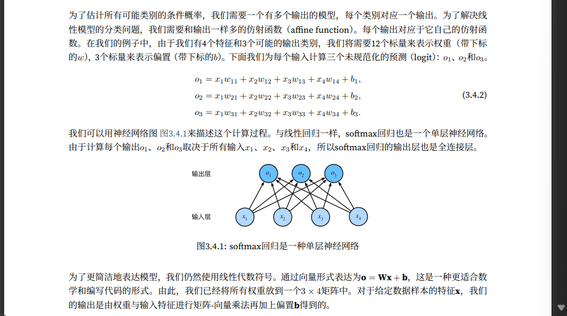

# Pytorch 神经网络学习笔记

## 范数

范数听起来很像距离的度量。欧几里得距离和毕达哥拉斯定理中的非负性概念和三角不等式可能会给出一些 启发。事实上，欧几里得距离是一个 $L_2$​ 范数：
$$
\vert\vert\mathbf{x}\vert\vert_2=\sqrt{\sum_{i=1}^{n}{x
_i^2}}
$$

```python
u = torch.tensor([3.0, -4.0])
torch.norm(u)
```

$L_1$​ 范数，它表示为向量元素的绝对值之和：
$$
\vert\vert\mathbf{x}\vert\vert_1=\sum_{i=1}^{n}{\vert x
_i\vert}
$$
以上都是更一般的 $L_p$​ 范数的特例：
$$
\vert\vert\mathbf{x}\vert\vert_p=(\sum_{i=1}^{n}{{\vert x
_i\vert}^p})^{1/p}
$$
类似的，矩阵 $\mathbf{X}\in\mathbb{R}^{n \times d}$​ 的 Frobenius 范数是矩阵元素的平方和的平方根：
$$
\vert\vert\mathbf{X}\vert\vert_F=\sqrt{\sum_{i=1}^{m}\sum_{j=1}^{n}x_{ij}^2}
$$


## 线性神经网络

### 线性回归

所有特征为向量 $\mathbf{x}\in\mathbb{R}^d$，所有权重为向量 $\mathbf{w}\in\mathbb{R}^d$​，用点积形式来简洁地表达模型：
$$
\hat{y}=\mathbf{w}^T\mathbf{x}+b
$$
对于整个数据集的 n 个样本，有 $\mathbf{X}\in\mathbb{R}^{n \times d}$，每一行是一个样本，每一列是一种特征。$\hat{y}\in\mathbb{R}^n$

通过矩阵向量乘积表示：
$$
\hat{y}=\mathbf{X}\mathbf{w}+b
$$

#### 损失函数

希望寻找一组参数 $(\mathbf{w}^*,b^*)$​ 最小化所有训练样本的总损失：
$$
\mathbf{w}^*,b^*={\underset{\mathbf{w},b}{\arg\min}\ L(\mathbf{w},b)}
$$

#### 正态分布和平方损失

随机变量 $x$ 具有均值 $\mu$ 和方差 $\sigma^2$​，正态分布表示为：
$$
p(x)=\frac{1}{\sqrt{2\pi\sigma^2}}\exp{(-\frac{1}{2\sigma^2}(x-\mu)^2)}
$$

```python
def normal(x, mu, sigma):
p = 1 / math.sqrt(2 * math.pi * sigma**2)
return p * np.exp(-0.5 / sigma**2 * (x - mu)**2)
```

均方误差损失函数可以用于线性回归的一个原因是：假设了观测中包含噪声，其中噪声服从正态分布 $\epsilon\sim\mathcal{N}(0,\sigma^2)$​。
$$
y=\mathbf{w}^T\mathbf{x}+b+\epsilon
$$
可以写出通过给定的 $\mathbf{x}$ 观测到特定 $y$​ 的似然：
$$
p(y\vert x)=\frac{1}{\sqrt{2\pi\sigma^2}}\exp{(-\frac{1}{2\sigma^2}(y-\mathbf{w}^T\mathbf{x}-b)^2)}
$$
根据极大似然估计法，参数 $\mathbf{w},b$​ 的最优值是使整个数据集的似然最大的值：
$$
P(y\vert x)=\prod_{i=1}^{n}p(y^{(i)}\vert x^{(i)})
$$

$$
-\log{P(y\vert x)}=\sum_{i=1}^{n}\frac{1}{2}\log{2\pi\sigma^2}+\frac{1}{2\sigma^2}(y-\mathbf{w}^T\mathbf{x}-b)^2
$$

```python
def squared_loss(y_hat, y):
    """均方损失"""
    return (y_hat - y.reshape(y_hat.shape)) ** 2 / 2
```

常数 $\frac{1}{2}$ 不会带来本质的差别，但是有利于计算导数后系数为 1。

#### 随机梯度下降

通常会在每次需要计算更新的时候随机抽取一小批样本，这种变体叫做小批量随机梯度下降，随机抽样一个小批量 $\mathcal{B}$，计算小批 量的平均损失关于模型参数的导数，将梯度乘以一个预先确定的正数η，并从 当前参数的值中减掉：
$$
(\mathbf{w},b)\leftarrow(\mathbf{w},b)-\frac{\eta}{\vert\mathcal{B}\vert}{\sum\limits_{i\in\mathcal{B}}}\partial_{(\mathbf{w},b)}l^{(i)}(\mathbf{w},b)
$$

```python
def sgd(params, lr, batch_size):
"""小批量随机梯度下降"""
    with torch.no_grad():
        for param in params:
            param -= lr * param.grad / batch_size
            param.grad.zero_()
```

### softmax 回归



***softmax 函数能够将未规范化的预测变换为非负数并且总和为 1，同时让模型保持可导。***
$$
\hat{y}=softmax(\mathbf{o}),\ \hat{y_j}=\frac{\exp{o_j}}{\sum_k{\exp{o_k}}}
$$
***对比hardmax，softmax不再唯一的确定某一个最大值，而是为每个输出分类的结果都赋予一个概率值，表示属于每个类别的可能性。***

小批量样本特征 $\mathbf{X}\in\mathbb{R}^{n \times d}$ ，权重 $\mathbf{W}\in\mathbb{R}^{n \times d}$ ，偏执 $\mathbf{b}\in\mathbb{	R}^{1\times q}$，softmax 回归的矢量计算表达式为：
$$
\mathbf{O}=\mathbf{X}\mathbf{W}+\mathbf{b}
$$

$$
\mathbf{\hat{Y}}=softmax(\mathbf{O})
$$

#### 交叉熵损失函数

> *和 softmax 一同使用？*
>
> *在计算 $\exp{o_k}$ 时可能出现上溢（overflow），若通过统一减去一个常数如 $\max{(o_k)}$来限制（对每个 $o_k$ 按一个常数位移不改变 softmax 的结果），由于 $o_j-\max{(o_k)}$​ 可能是较大负值，而其 exp 指数将接近零而被四舍五入出现下溢（underflow），并使得其对数为负无穷大*
>
> *softmax 与交叉熵一同使用即可在取对数和求 exp 指数抵消*

$$
l(\mathbf{y},\mathbf{\hat{y}})=-\sum_{j=1}^{q}y_j\log{\hat{y_j}}\\
=\log{\sum_{k=1}^q\exp{o_k}}-\sum_{j=1}^qy_jo_j
$$

$$
\partial_{o_j}l(\mathbf{y},\mathbf{\hat{y}})=\frac{\exp{o_j}}{\sum_{k=1}^q{\exp{o_k}}}=softmax(o)_j-y_j
$$

信息论的核心思想是量化数据中的信息内容。在信息论中，该数值被称为分布 $P$​ 的熵。可以通过 以下方程得到：
$$
H[P]=\sum_j{-P(j)\log{P(j)}}
$$
们可以把交叉熵想象为“主观概率为 $Q$ 的观察者在看到根据概率 $P$​ 生成的数据时的预期惊异”。

从两方面来考虑交叉熵分类目标：

- 最大化观测数据的似然
- 最小化传达标签所需的惊异。

```python
def cross_entropy(y_hat, y):
    """交叉熵损失"""
	return - torch.log(y_hat[range(len(y_hat)), y])
```

#### softmin？


## 多层感知机 MLP

> *仿射变换的仿射变换仍是仿射变换，简单通过多层线性全连接层增加层数是无效的。*
>
> *在仿射变换之后对每个隐藏单元应用非线性的激活函数 $\sigma$，即可避免多层感知机退化为线性模型。*
>
> 

> *虽然一个单隐层网络能学习任何函数，但并不意味着我们应该尝试使用单隐藏层网络来解决所有问题。事实上，通过使用更深（而不是更广）的网络，我们可以更容易地逼近许多函数。*

### 激活函数

 [激活函数.md](激活函数.md) 

###  模型选择、过拟合、欠拟合

#### 模型的训练误差、泛化误差

- 训练误差是指，模型在训练数据集上计算得到的误差。
- 泛化误差模型应用在同样从原始样本的分布中抽取的无限多数据样本时，模型误差的期望。

#### 几个倾向于影响模型泛化的因素：

- 当可调整参数的数量（有时称为自由度）很大时，模型往往更容易过拟合。
- 当权重的取值范围较大时，模型可能更容易过拟合。
- 即使模型很简单，也很容易过拟合只包含一两个样本的数据集。而过拟合一个有数百 万个样本的数据集则需要一个极其灵活的模型。
