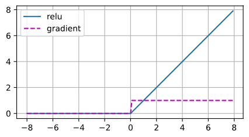
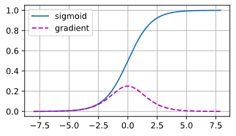
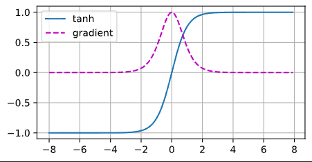

# ReLU

## 修正线性单元（Rectified linear unit）

$$
ReLU(x)=\max{(x,0)}
$$

当输入为负时，ReLU 函数的导数为 0，而当输入为正时，ReLU 函数的导数为 1。注意，当输入值精确等于 0 时， ReLU 函数不可导，此时默认使用左侧导数，及输入为 0 时导数为 0。

```python
def relu(X):
	a = torch.zeros_like(X)
	return torch.max(X, a)
```



## 参数化 ReLU（Parameterized ReLU, pReLU）

$$
pReLU(x)=\max{(x,0)}+\alpha\min{(0,x)}
$$

该 变体为 ReLU 添加了一个线性项，因此即使参数是负的，某些信息仍然可以通过。

# sigmoid

对于一个定义域在 $\mathbb{R}$ 中的输入，sigmoid 函数将输入变换为区间 (0, 1) 上的输出。因此通常被称为挤压函数（squashing function）
$$
sigmoid(x)=\frac{1}{1+\exp{(-x)}}
$$
sigmoid 函数的导数：
$$
\frac{d}{dx}sigmoid(x)=\frac{\exp{(-x)}}{(1+\exp{(-x)})^2}=sigmoid(x)(1-sigmoid(x))
$$



# tanh

双曲正切函数能将输入压缩转换到区间 (‐1, 1) 上。
$$
\tanh(x)=\frac{1-\exp(-2x)}{1+\exp{(-2x)}}
$$
注意，当输入在 0 附近时，tanh 函数接近线性变换。其导数是：
$$
\frac{d}{dx}\tanh{(x)}=1-\tanh^2{(x)}
$$
当输入接近 0 时，tanh 函数的导数接近最大值 1。


