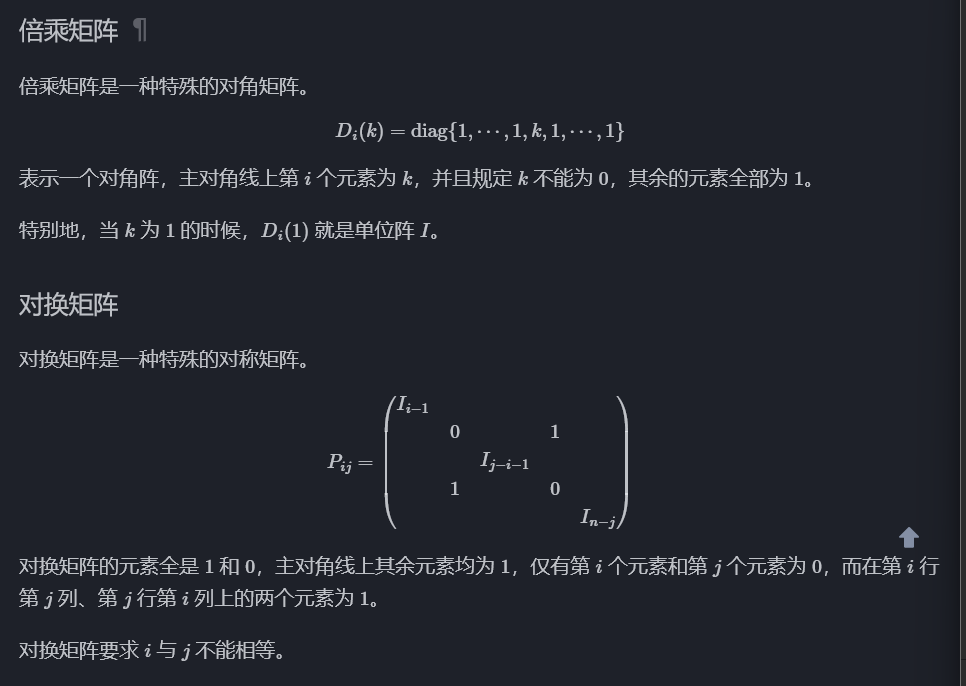
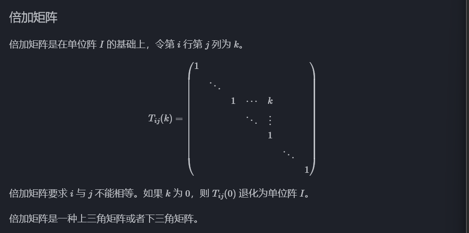
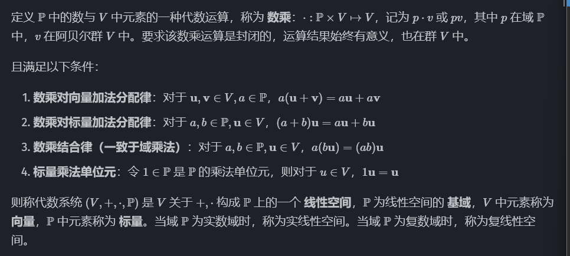
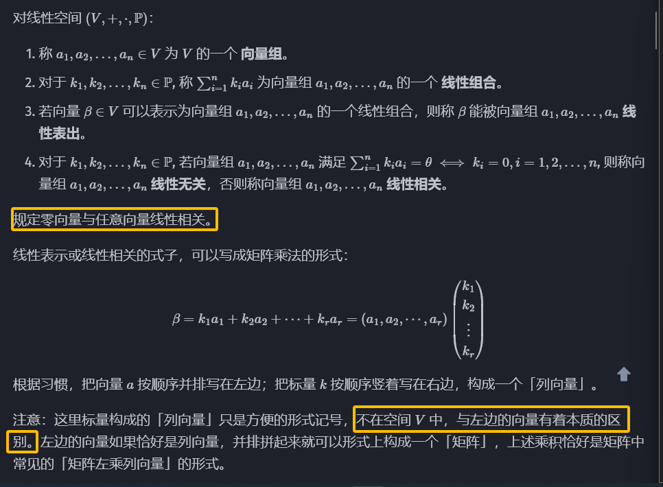
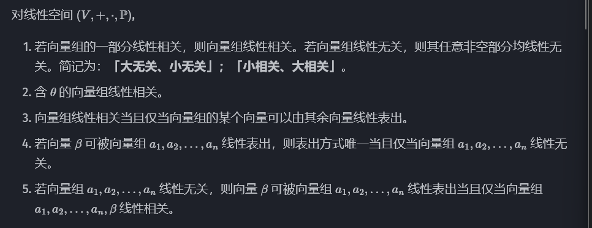
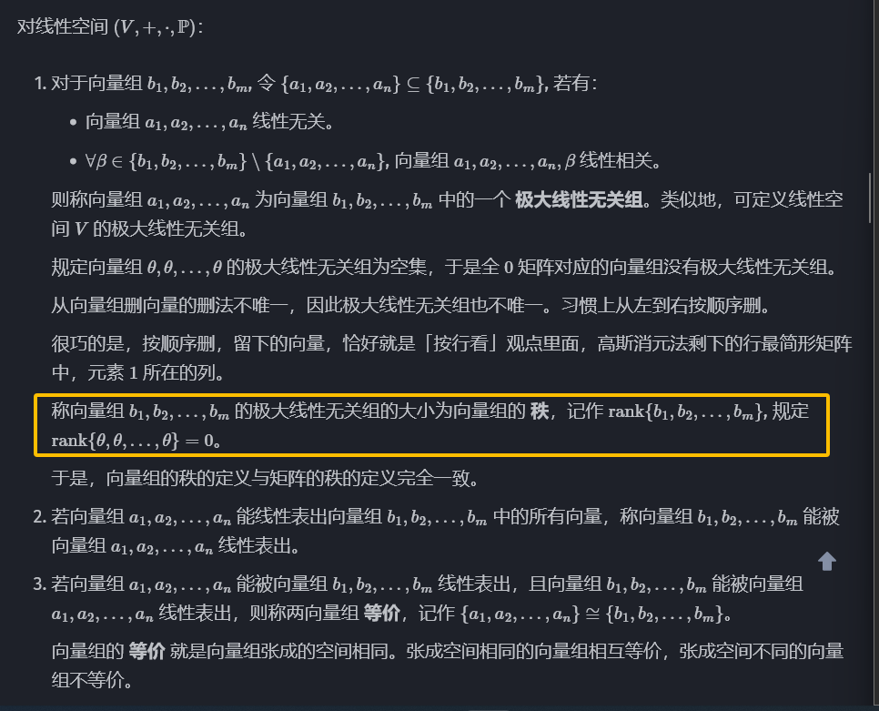
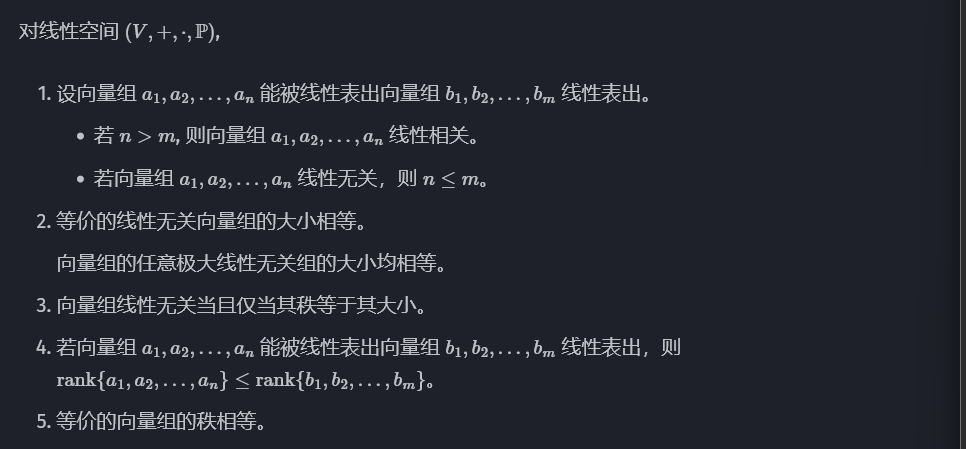
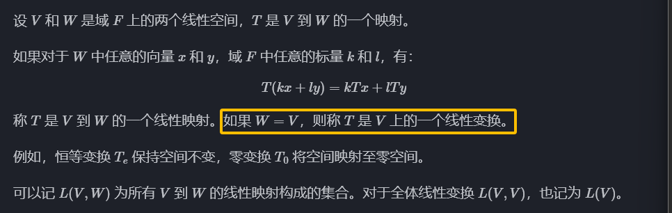

# 向量内积和外积

即点乘和叉乘

- 内积的概念对于==任意维数==的向量都适用，又称点积和数量积。已知两个向量和他们的夹角，则 $\mathbf{a}\cdot\mathbf{b}=\vert\mathbf{a}\vert\vert\mathbf{b}\vert\cos{\theta}$，这种运算得到的结果是一个标量，并不属于向量的线性运算。
- 外积是==三维向量特有的==运算。$\mathbf{a}\times\mathbf{b}=\vert\mathbf{a}\vert\vert\mathbf{b}\vert\sin{<a,b>}$，外积可以用三阶行列式表示：

$$
\left|
\begin{array}{cccc} 
    i   &   j   &   k \\ 
   x_1  &  y_1  &  z_1\\ 
   x_2  &  y_2  &  z_2 
\end{array}
\right| 
$$

# 初等变换

## 初等矩阵

# 线性空间

> *一个集合关于某运算封闭，满足结合律、单位元与逆元则构成群。如果还满足交换律，则构成==阿贝尔群==。*
>
> *如果一个集合关于四则运算封闭，则构成==域==。*

线性空间是由向量集合 $V$，域 $\mathbb{P}$，加法运算和数乘组成的==模类代数结构==。

具体来说 $(V,+)$ 是一个阿贝尔群，$\mathbb{P}$ 是一个域。

称加法群中的零元为零向量，记为 0 或 $\theta$ 。

原阿贝尔群中向量的加减法，与线性空间新定义的数乘，统称为==线性运算==。

## 线性相关和线性无关

### 定义

这里的线性表示也等价于，向量 $\beta$ 落在矩阵 $(a_1...,a_r)$​ 的像空间内。

### 性质

## 极大线性无关组、==秩==

> *线性相关可以理解为「多余」，说明向量组内部有的向量可以被其他向量表出，可以删去。删完了之后，将剩下极大线性无关组。*

### 定义

- 向量组等价比矩阵等价条件更强，不仅要求秩相同，还要求空间完全一样。因此，把两个矩阵横向拼在一起，秩不能发生变化。

- 矩阵等价仅要求秩相同，因此矩阵等价表示前一个矩阵或空间，可以通过可逆变换，到达后一个矩阵或空间。

### 性质

# 线性映射

## 线性映射与线性变换

### 定义

### 性质

- 线性映射将零向量映射到零向量。
- 线性映射保持线性运算形式不变，即，线性运算的线性映射，等于线性映射的线性运算。
- 线性映射保持线性相关性，即，映射前线性相关，映射后也线性相关。

但是线性映射不保持线性无关性。映射前线性无关，映射后不一定线性无关。

# 特征多项式

## 特征值与特征向量

### 定义

$V$ 是 $F$ 上的线性空间，$T$ 是 $V$ 上的线性变换。若存在 $F$ 中的 $\lambda$ 与 $V$ 中的非零向量 $\xi$，使得：
$$
T\xi=\lambda\xi
$$
则称 $\lambda$ 为 $T$ 的一个特征值，$\xi$ 为 $T$ 的属于该特征值的一个特征向量。

> *特征向量在同一直线上，在线性变换作用下保持方向不改变（压缩到零也认为是方向不改变）。特征向量不唯一，与特征向量共线的向量都是特征向量，但是==规定零向量不是特征向量==，拥有方向的向量自然是非零向量。特征向量的特征值就是它伸缩的倍数。*
