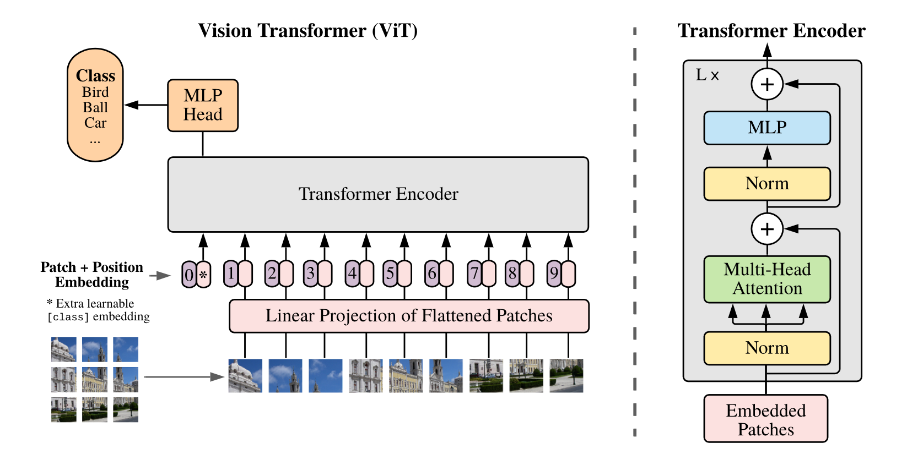
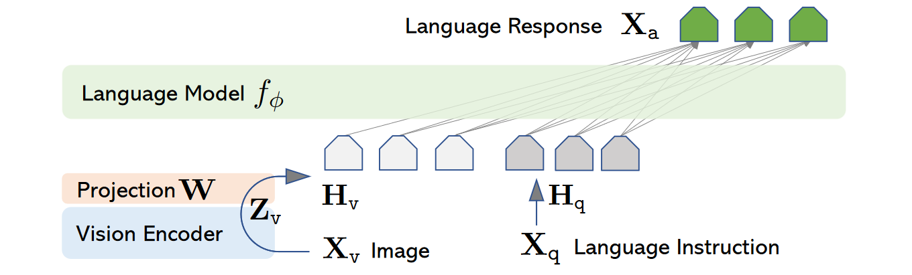
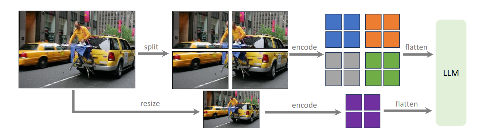
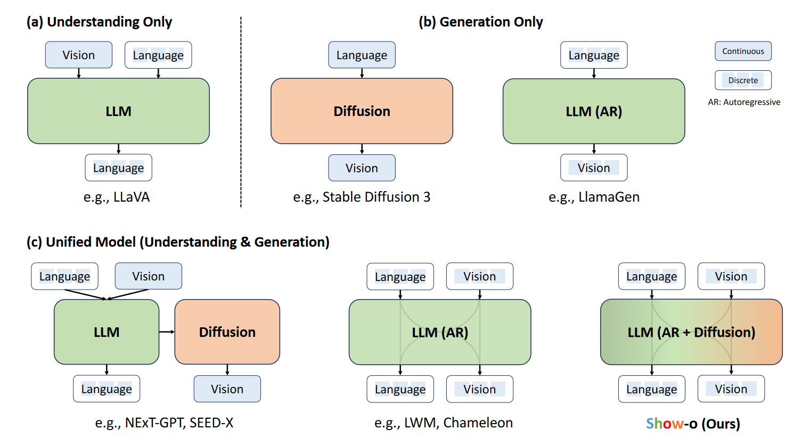
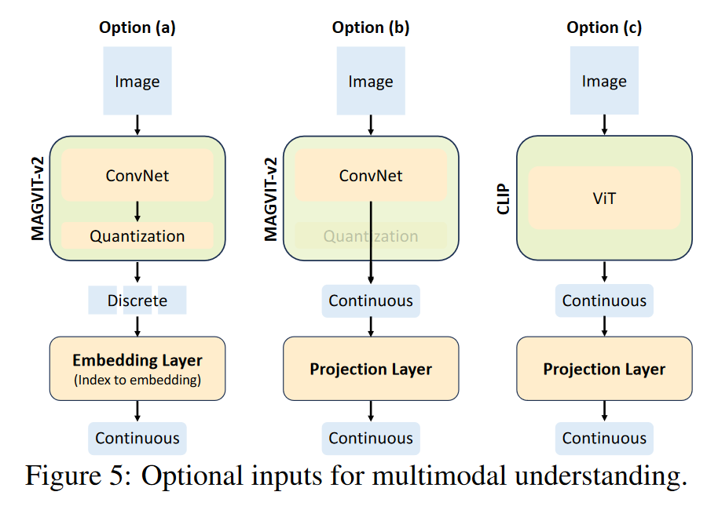
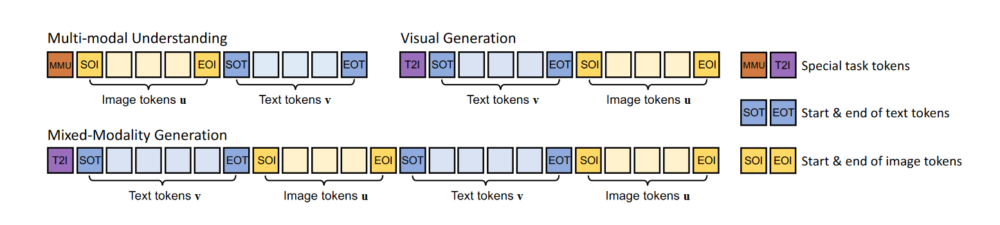
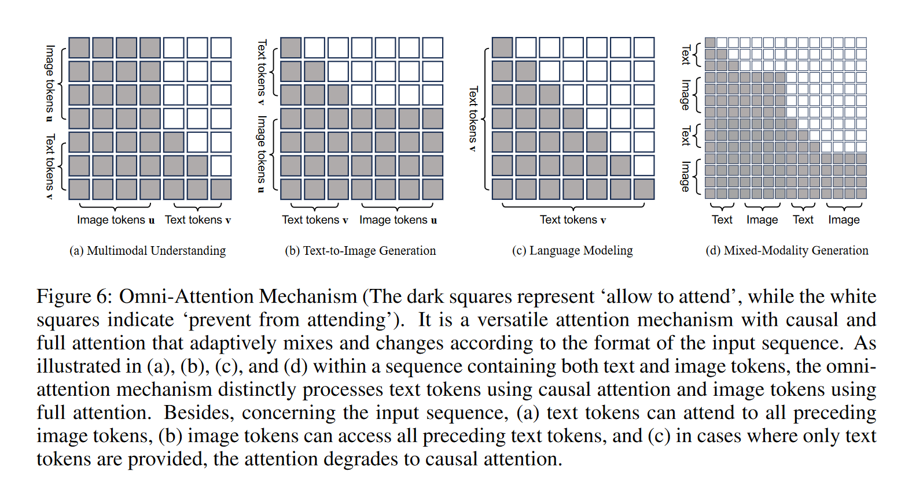
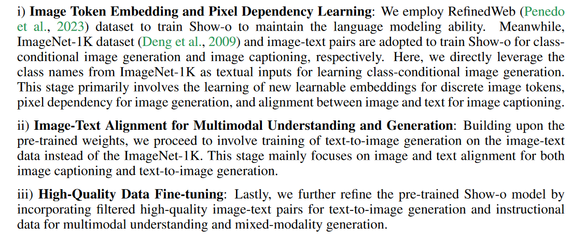
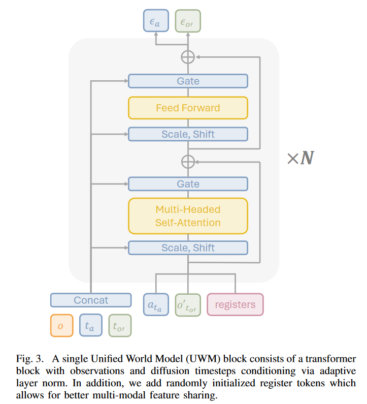

> Referenc:
>
> https://www.armcvai.cn/2024-11-28/llava-structure.html
>
> https://zhuanlan.zhihu.com/p/28971454220

# Background

## Vison Transformer - ViT

一个`ViT Block`包括五个部分：

1. `Patch Embeddings`：图像划分成大小固定的patch，patch展平为向量，经过线性投影
2. `Position Embeddings`：位置编码，提供Transformer每个patch在图像中的位置
3. `Transformer Encoder`：与NLP类似，包含Multi-Head Self Attention & Feed-Forward Network（FFN，激活函数为GLUE）
4. `Classification Head`：通常将Transformer输出的第一个token传入全连接层MLP
5. `Layer Normalization and Skip Connections`：在每个子层之后使用层归一化和残差链接

## Diffusion

在连续场景下，前向加噪过程表示为：
$$
q(\mathbf{x}_t|\mathbf{x}_{t-1})=\mathcal{N}(\mathbf{x}_t|\sqrt{1-\beta_t}\mathbf{x}_{t-1},\beta_t\mathbf{I})
$$
对于离散为K个类别的场景则用随机转移矩阵表示：
$$
q(\mathbf{x}_t|\mathbf{x}_{t-1})=Cat(\mathbf{x}_t|\mathbf{x}_{t-1}\mathbf{Q}_t)
$$

$$
q(\mathbf{x}_t|\mathbf{x}_0)=Cat(\mathbf{x}_t|\mathbf{x}_0\overline{\mathbf{Q}}_t)
$$

该过程是马尔科夫的，由贝叶斯公式计算得：
$$
q(\mathbf{x}_{t-1}|\mathbf{x}_t,\mathbf{x}_0)=q(\mathbf{x}_{t-1}|\mathbf{x}_t)=Cat(\mathbf{x}_t|\frac{\mathbf{x}_tQ_t^\mathrm{T}⊙\mathbf{x}_0\overline{\mathbf{Q}}_{t-1}}{\mathbf{x}_0\overline{\mathbf{Q}}_t\mathbf{x}_t^\mathrm{T}})
$$

> 哈达玛积
>
> $$
> \left(\begin{array}{lll}a_{11} & a_{12} & a_{13} \\a_{21} & a_{22} & a_{23} \\a_{31} & a_{32} & a_{33}\end{array}\right) \odot\left(\begin{array}{lll}b_{11} & b_{12} & b_{13} \\b_{21} & b_{22} & b_{23} \\b_{31} & b_{32} & b_{33}\end{array}\right)=\left(\begin{array}{llll}a_{11} b_{11} & a_{12} b_{12} & a_{13} b_{13} \\a_{21} b_{21} & a_{22} b_{22} & a_{23} b_{23} \\a_{31} b_{31} & a_{32} b_{32} & a_{33} b_{33}\end{array}\right)
> $$

---

# VLM（多模态模型/视觉语言模型）

常见模型架构是`视觉编码器`+`映射层`+`LLM`，如VILA-1.5，LLaVA，QWen-VL等

## LLaVA系列

### LLaVA

$$
H_V=W \cdot Z_V,\ where\ Z_V=g(X_V)
$$

#### Architecture

预训练CLIP模型的视觉编码器`ViT-L/14`+`线性映射层`+`LLama or Vicuna(基于LLama2微调)`

> `ViT-B`（Base）：通常有 12 层 Transformer
>
> `ViT-L`（Large）：通常有 24 层 Transformer
>
> `ViT-H`（Huge）：通常有 32 层 Transformer
>
> `ViT-L/14`表示ViT会将图像分割成14x14的patch

#### Training

1. 图像和语言特征对齐：冻结Vision Encoder和LLM，预训练Projection权重
2. 指令微调：使用ChatGPT生成的具有上下文的数据ScienceQA数据集，微调投影矩阵和LLM

### LLaVA-1.5-HD

#### Improvements vs LLaVA

1. 使用2层的线性投影层
2. 输入图像的分辨率从224x224提高到336x336（CLIP支持的分辨率上限）
3. 使用分辨率更大的图像，先将其分为若干与视觉编码器一致的块，依此编码后合并为大特征图输入LLM，同时将下采样（resize）的原始图像合并到特征图中

4. 对于期望回答的长短进行明确的指令提示
5. 使用更多样化数据集训练

#### Experiment

* LLaVA-1.5预训练和训练数据量小，但效果更好

* 提升分辨率有助于模型减少幻觉

### LLaVA-NeXT/1.6

支持更大更多种分辨率

### LLaVA-OneVision

#### Improvements

1. 更多样化数据（>1M）~9M
2. 训练中第一、二步之间使用高质量的新数据微调模型，并在第二步中依此使用单个图片、视频、多图片上指令微调
3. 使用插值方式减少高清图像、多帧视频的token数量

## Show-o

> **Q: can such one single transformer involve both autoregressive and diffusion modeling?**
>
> 文本天然适合自回归模型（AR），其嵌入空间是连续的，但处理的token是离散；图像生成的常用的扩散模型，图像表征方式可以是连续的像素值or离散的token。两种表征范式需要统一。
>
> 相比于使用额外的Diffusion模块，使用一个Transformer融合自回归建模和扩散模型。

### Tokenization

* Text tokenizer：直接使用pre-trained LLM

* Image tokenizer：借鉴`MAGVIT-v2`，使用3500w张图像训练一个大小为8192的码本，可将分辨率256x256的图像编码为16x16的离散token

  

### Architecture

继承常规的LLM结构，关键调整包括：

1. 在每个注意力层前增加`QK-Norm`操作
2. 在原有文本token的嵌入层基础上扩展了8192个可学习嵌入，用于离散的图像token

### Unified Prompting

### Omni-Attention Mechanism

对于文本使用因果注意力，对于图像使用全注意力

### Training Objectives

为同时实现自回归建模和离散扩散建模，需要两个训练目标：

1. Next Token Prediction
   $$
   \mathcal{L}_{NTP}=\sum_i\mathrm{log}p_\theta(v_i|v_1,...,v_{i-1},u_1,...,u_{i-1})
   $$

2. Mask Token Prediction

   使用`MaskGIT`实现视觉和文本token的统一训练，每一步随机将部分图像token转换为MASK，标记为$u_*$

   $$
   \mathcal{L}_{MTP}=\sum_i\mathrm{log}p_\theta(u_j|u_*,u_x,...,u_*,u_M,v_1,...,v_N)
   $$

最终的损失函数是两者的加权和

### Training Pipeline

# What matters in building VLAs

## Why do we prefer VLAs?

1. VLAs是否是构建通用机器人策略的合适选择？

   视觉 - 语言 - 动作模型（VLA）是实现通用机器人策略的一条有前景的路径。

2. 基于RoboVLMs构建的最佳VLA在现实场景中的表现如何？

   利用 RoboVLMs 构建的最佳配置的视觉 - 语言 - 动作模型（VLA）在现实世界场景中表现出强大的有效性和鲁棒性。

## Which VLM backbone is more suitable for VLAs?

1. 哪种类型的VLMs更适合构建VLAs？

   在大规模视觉 - 语言数据集上进行充分视觉 - 语言预训练的模型有利于视觉 - 语言 - 动作模型（VLAs）。

## How should we formulate VLAs?

1. 性能最佳的VLA结构是什么？

   具有策略头以整合历史信息的连续动作空间是最佳结构。

2. 不同的结构形式对VLAs的泛化能力和数据效率有何影响？

   采用单独策略头进行历史融合的 KosMos 骨干网络在泛化能力和数据效率方面表现最佳。

## When should we leverage cross-embodiment datasets? 

1. 大规模跨实体数据集对VLAs有何贡献？

   额外的域内数据是有益的；在（跨实体）预训练后进行微调（post-training）能进一步提高整体性能以及少样本性能。

# Unified World Models

## Problem Setup & Flexible Inference

构建一个统一的`Diffusion`模型，同时建模以下四个分布，可以自然的构建一个联合噪声预测网络，来估计$\mathbb{E}[\epsilon_a,\epsilon_{o’}|o,a_t,o_t']$，但是动作和未来的观测与同一个t耦合，只能采样联合分布

| 任务           | 目标分布    | 时间步设置              | 采样流程                                                     |
| -------------- | ----------- | ----------------------- | ------------------------------------------------------------ |
| 策略           | $p(a|o)$    | $t_{o'}=T$              | 固定未来观测为噪声，对动作执行反向扩散$t_a=T:1$              |
| 视频预测       | $p(o'|o)$   | $t_a=T$                 | 固定动作为噪声，对未来观测执行反向扩散$t_{o'}=T:1$           |
| 正动力学       | $p(o'|o,a)$ | $t_a=0$                 | 即已知当前动作和当前观测，预测接下来观测会变成什么样，固定动作为真实值，对未来观测执行反向扩散$t_{o'}=T:1$ |
| 逆动力学       | $p(a|o,o')$ | $t_{o'}=0$              | 即已知当前观测和接下来的观测，预测中间动作，固定未来观测为真实值，对动作执行反向扩散$t_a=T:1$ |
| 无条件视频预测 | $p(o'|o)$   | $t_a=T,o=\mathrm{NULL}$ | 无当前观测，动作为噪声，对未来观测执行反向扩散$t_{o'}=T:1$   |

## Architecture

Diffusion Transformer即传统U-Net替换为ViT

### 输入编码

1. 当前观测o，经ResBet-18编码
2. 噪声动作，经MLP编码动作片段为固定维度的嵌入
3. 噪声观测，经SDXL VAE压缩到潜在空间，分块，展平
4. 扩散步，通过正弦位置编码

### UWM Blk

### 输出解码

1. 若输入为带噪动作，输出为动作噪声预测

2. 若输入为带噪观测，输出为观测噪声预测
