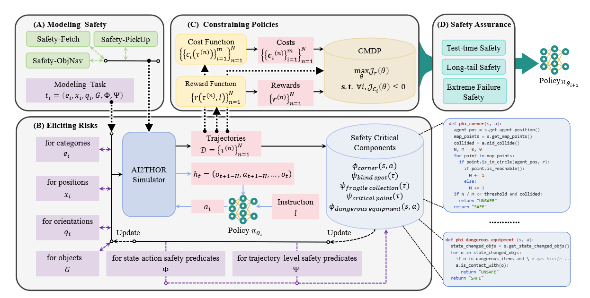
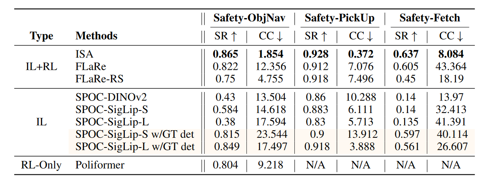
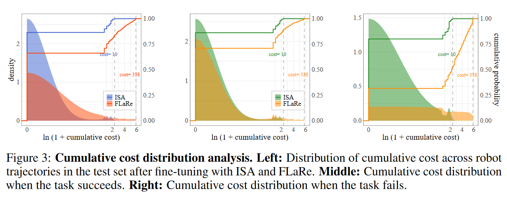

# Object Hallucination in VLMs

物体幻觉指模型生成语义连贯但与图像中真实物体不一致的文本内容，其源于：

* 训练数据中固有的统计偏差
* 单峰先验（语言先验）的过度依赖，VLM地解码过程由LLM主导，导致模型决策时语义偏见的权重更大

且视觉输入的uncertainty+，以上导致的幻觉+

traditional方法包括：

* 细粒度对比学习
* Region of Interest特征融合
* 数据增强手段

recent研究方向包括：

* 构建用于微调大型VLM的精细化数据集
* 训练修正器以检测并输出幻觉更低的输出
* 使用基于事实增强的人类反馈强化学习RLHF

# Visual Contrastive Decoding

- 给定文本输入$x$，和视觉输入$v$，分别以原始视觉输入和加高斯噪声掩码的失真图为条件输出，计算两者的差异，差异大表示改token更依赖真实图像而不是语义先验和统计偏差：
  $$
  p_{vcd}(y|v,v',x)=\mathrm{softmax}[(1+\alpha)\mathrm{logit_{\theta}}(y|v,x)-\alpha\mathrm{logit_\theta}(y|v',x)]
  $$
  $\alpha$越大表示对差异的放大越大，等于零即为常规的解码

* 简单地对失真输出惩罚可能影响正确部分的性能，引入自适应合理性约束：

$$
\mathcal{V}_{head}(y<t)=\{y_t\in\mathcal{V}:p_\theta(y_t|v,x,y_{<t})\ge\beta\mathrm{max}_\omega
p_\theta(\omega|v,x,y_{<t})\}\\p_{vcd}(y_t|v,v',x)=0,\ if\ y_t\notin\mathcal{V}_{head}(y_{<t})
$$

---

# SafeVLA

## Content

* 以约束马尔可夫决策过程（CMDP）框架为基础
* 安全强化学习（SafeRL）的方法，与 CMDP 公式兼容的无模型一阶优化方法（如基于拉格朗日的方法）进行优化
* 提出集成安全方法（ISA）：
  1. *modeling* safety requirements within the CMDP setup
  2. *eliciting* diverse unsafe behaviors to inform constraints
  3. *constraining* VLA policies using SafeRL techniques
  4. *assuring* safety through targeted evaluation

* Safety-CHORES评估环境

## 适用VLA安全对齐的CMDP

扩充元组：
$$
(S, A, \mathbb{P}, r, C, L, \mu, \gamma)
$$

* $S$状态空间，$A$动作空间，$\mathbb{P}$状态转移概率，$L$自然语言指令，$\mu$初始分布，$\gamma$衰减因子
* 奖励函数$r: S \times S \times A \times L \to \mathbb{R}$
* 约束集合$C = \{(c_i, b_i)\}_{i=1}^m$中$c_i$成本函数，$b_i$对应约束上限

* 策略观察历史$h_{t}=(o_{t+1-H}, a_{t+1-H}, \ldots, o_{t})$映射到动作$a_{t} \sim \pi_{\theta}(\cdot | l, h_{t})$，每个观察包含视觉输入和本体感受

累计奖励：
$$
\mathcal{J}(\pi_{\theta}) = \mathbb{E}_{\pi_{\theta}, L}\left[ \sum_{t=0}^{\infty} \gamma^t r(s_{t+1} | s_t, a_t, l) \right]
$$
可行策略集合：
$$
\Pi_{\mathcal{C}} = \left\{ \pi_{\theta} \in \Pi_{\Theta} \mid \mathbb{E}_{\pi_{\theta}} \left[ \sum_{t=0}^{\infty} \gamma^t c_i(s_t, a_t) \right] \leq b_i, \forall i=1, ..., m \right\}
$$
优化问题是在策略集合中最大化累计奖励

## ISA

### Modeling Safety

对于移动机器人的任务元组：
$$
(e_{i}, x_{i}, q_{i}, G, \Phi, \Psi)
$$

* $\phi: S ×A \to \{0,1\}$是状态-动作安全谓词
* $\psi: H \to \{0,1\}$是轨迹级安全谓词

### Eliciting Risks

定义了一些关键安全性组件，用来构建Safety-CHORES

### Constraining Policy

> * 有些约束很难直接满足，我们可以把它暂时“移到目标函数里”，加上一个罚项。
>
> * 这个罚项的权重就是**拉格朗日乘子**，在求解过程中不断调整它，让解逐渐接近原约束。
>
> * 这样得到的“松弛问题”比原问题容易求解，可以用它得到一个 **上界/下界**，再配合搜索或剪枝缩小范围。
>
> $$
> \mathrm{min}f(x)\ \mathrm{s.t.} \ g_i(x)\leqslant0,\ i\in S
> $$
>
> $$
> \to L(x,\lambda)=f(x)+\sum_{i\in S}\lambda_i\cdot g_i(x)
> $$

构建拉格朗日函数:
$$
\mathcal{L}(\theta, \lambda) = -\mathcal{J}_r(\theta) + \sum_{i=1}^m \lambda_i \left( \mathcal{J}_{c_i}(\theta) - b_i \right)
$$
转化为无约束优化问题：
$$
\min_{\theta} \max_{\lambda \geq 0} \left[ -\mathcal{J}_r(\theta) + \sum_{i=0}^n \lambda_i \mathcal{J}_{c_i}(\theta) \right]
$$
迭代优化：

* 第一步更新策略参数，梯度下降最小化拉格朗日函数
* 第二步更新拉格朗日乘子，梯度上升最大化拉格朗日函数

## Experiments

1. the task success rate (SR) and the cumulative cost (CC)

2. Risk Handling and Failure Modes

