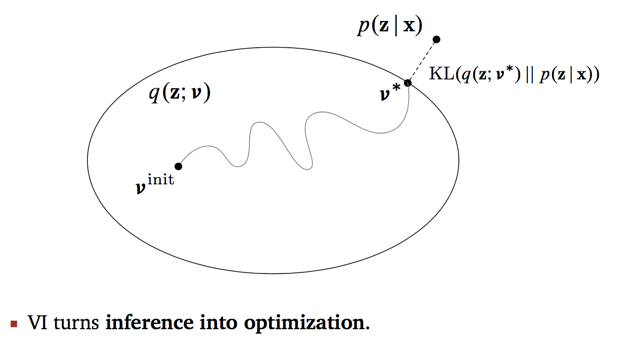

# Problem

* 给定observation variable $x$，和潜变量 $z$，比如RGB图像经过encoder得到了latent feature，想要学习后验概率 $p(z|x)$，但是又无法容易地求解

* `VI`要做的是在整个概率分布空间中，找到另一个好求解的替代分布，使得与原始地后验概率分布最近，即找到一个：
  $$
  q^*(z)=\arg\min\limits_{q(z)\in Q}L(q(z),p(z|x))
  $$

# Evidence Lower Bound (ELBO)

取KL散度来度量两个概率分布之间的距离，将问题转化为变分贝叶斯（VB）问题，目标转化为最小化KL散度：
$$
\arg\min\limits_{q(z)\in Q}\mathrm{KL}(q(z)||p(z|x))\\
=\arg\min\limits_{q(z)\in Q}-\int_zq(z)\mathrm{log}[\frac{p(z|x)}{q(z)}]dz\\
=\arg\min\limits_{q(z)\in Q}[\int_zq(z)dz-\int_zq(z)\mathrm{log}p(z|x)dz]\\
=\arg\min\limits_{q(z)\in Q}\{\mathbb{E}_q[\mathrm{log}q(z)]-\mathbb{E}_q[\mathrm{log}q(z|x)]\}\\
=\arg\min\limits_{q(z)\in Q}\{\mathbb{E}_q[\mathrm{log}q(z)]-\mathbb{E}_q[\mathrm{log}[\frac{p(x,z)}{p(x)}]]\}\\
=\arg\min\limits_{q(z)\in Q}\{\mathbb{E}_q[\mathrm{log}q(z)]-\mathbb{E}_q[\mathrm{log}p(x,z)]+\mathbb{E}_q[\mathrm{log}p(x)]\}
$$
第三项与$q(z)$无关，前二项构成`-ELBO`，可以写作：
$$
\mathrm{ELBO}(q)=\mathbb{E}_q[\mathrm{log}p(x,z)]-\mathrm{KL}(q_z||p(z))\\
$$
因为第一项即为$\mathrm{log}p(x)$是常数，实际的优化目标转化为最大化ELBO

> why called ELBO
>
> 因为KL散度始终大于零，对于表达式$\mathrm{log}p(x)=\mathrm{ELBO}(q)+\mathrm{KL}(q(z)||p(z|x))$，ELBO即为数据Evidence $\mathrm{log}p(x)$的下界