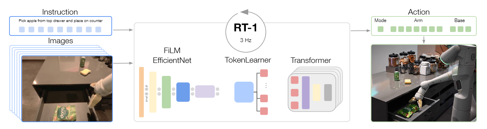
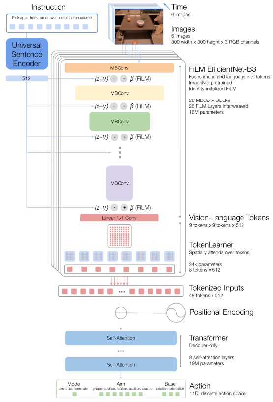
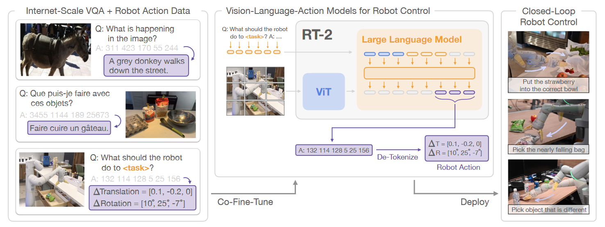

# What matters in building VLAs

## Why do we prefer VLAs?

1. VLAs是否是构建通用机器人策略的合适选择？

   视觉 - 语言 - 动作模型（VLA）是实现通用机器人策略的一条有前景的路径。

2. 基于RoboVLMs构建的最佳VLA在现实场景中的表现如何？

   利用 RoboVLMs 构建的最佳配置的视觉 - 语言 - 动作模型（VLA）在现实世界场景中表现出强大的有效性和鲁棒性。

## Which VLM backbone is more suitable for VLAs?

1. 哪种类型的VLMs更适合构建VLAs？

   在大规模视觉 - 语言数据集上进行充分视觉 - 语言预训练的模型有利于视觉 - 语言 - 动作模型（VLAs）。

## How should we formulate VLAs?

1. 性能最佳的VLA结构是什么？

   具有策略头以整合历史信息的连续动作空间是最佳结构。

2. 不同的结构形式对VLAs的泛化能力和数据效率有何影响？

   采用单独策略头进行历史融合的 KosMos 骨干网络在泛化能力和数据效率方面表现最佳。

## When should we leverage cross-embodiment datasets? 

1. 大规模跨实体数据集对VLAs有何贡献？

   额外的域内数据是有益的；在（跨实体）预训练后进行微调（post-training）能进一步提高整体性能以及少样本性能。

---

# Unified World Models

## Problem Setup & Flexible Inference

构建一个统一的`Diffusion`模型，同时建模以下四个分布，可以自然的构建一个联合噪声预测网络，来估计$\mathbb{E}[\epsilon_a,\epsilon_{o’}|o,a_t,o_t']$，但是动作和未来的观测与同一个t耦合，只能采样联合分布

| 任务           | 目标分布    | 时间步设置              | 采样流程                                                     |
| -------------- | ----------- | ----------------------- | ------------------------------------------------------------ |
| 策略           | $p(a|o)$    | $t_{o'}=T$              | 固定未来观测为噪声，对动作执行反向扩散$t_a=T:1$              |
| 视频预测       | $p(o'|o)$   | $t_a=T$                 | 固定动作为噪声，对未来观测执行反向扩散$t_{o'}=T:1$           |
| 正动力学       | $p(o'|o,a)$ | $t_a=0$                 | 即已知当前动作和当前观测，预测接下来观测会变成什么样，固定动作为真实值，对未来观测执行反向扩散$t_{o'}=T:1$ |
| 逆动力学       | $p(a|o,o')$ | $t_{o'}=0$              | 即已知当前观测和接下来的观测，预测中间动作，固定未来观测为真实值，对动作执行反向扩散$t_a=T:1$ |
| 无条件视频预测 | $p(o'|o)$   | $t_a=T,o=\mathrm{NULL}$ | 无当前观测，动作为噪声，对未来观测执行反向扩散$t_{o'}=T:1$   |

## Architecture

Diffusion Transformer即传统U-Net替换为ViT

### 输入编码

1. 当前观测o，经ResBet-18编码
2. 噪声动作，经MLP编码动作片段为固定维度的嵌入
3. 噪声观测，经SDXL VAE压缩到潜在空间，分块，展平
4. 扩散步，通过正弦位置编码

### UWM Blk

### 输出解码

1. 若输入为带噪动作，输出为动作噪声预测

2. 若输入为带噪观测，输出为观测噪声预测

# RT-1

## Architecture

# RT-2

