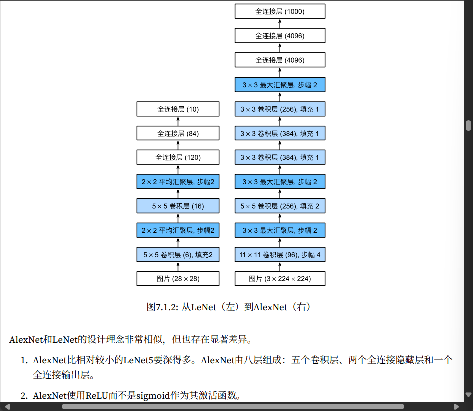
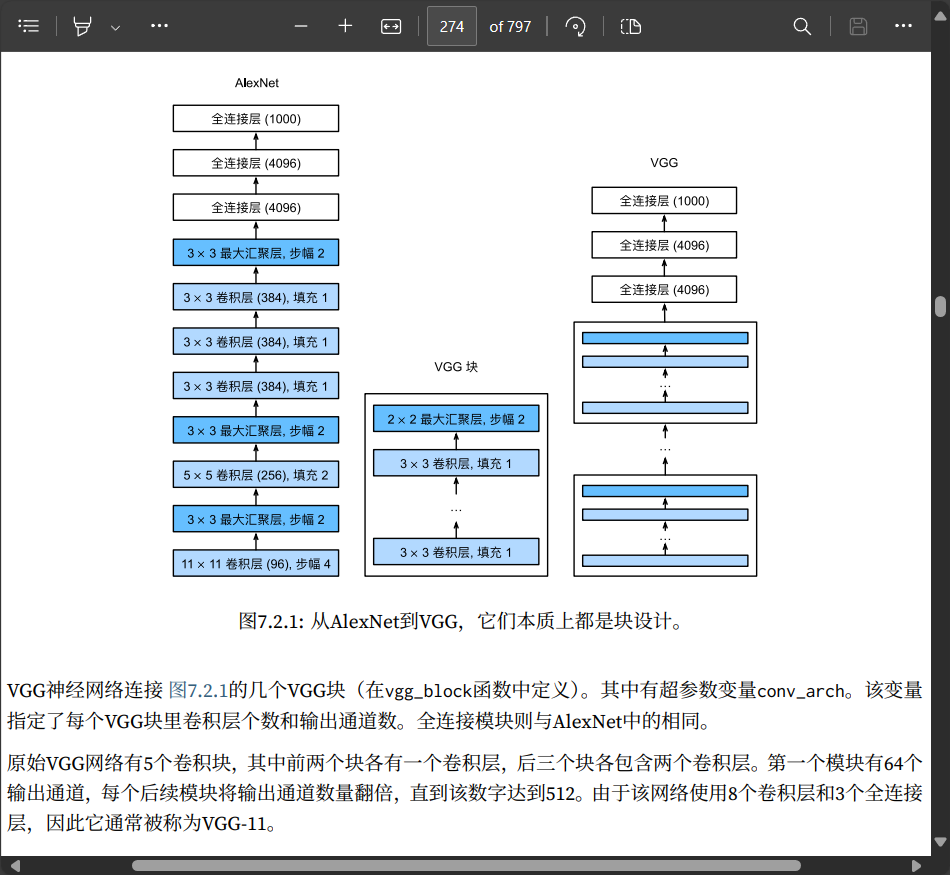
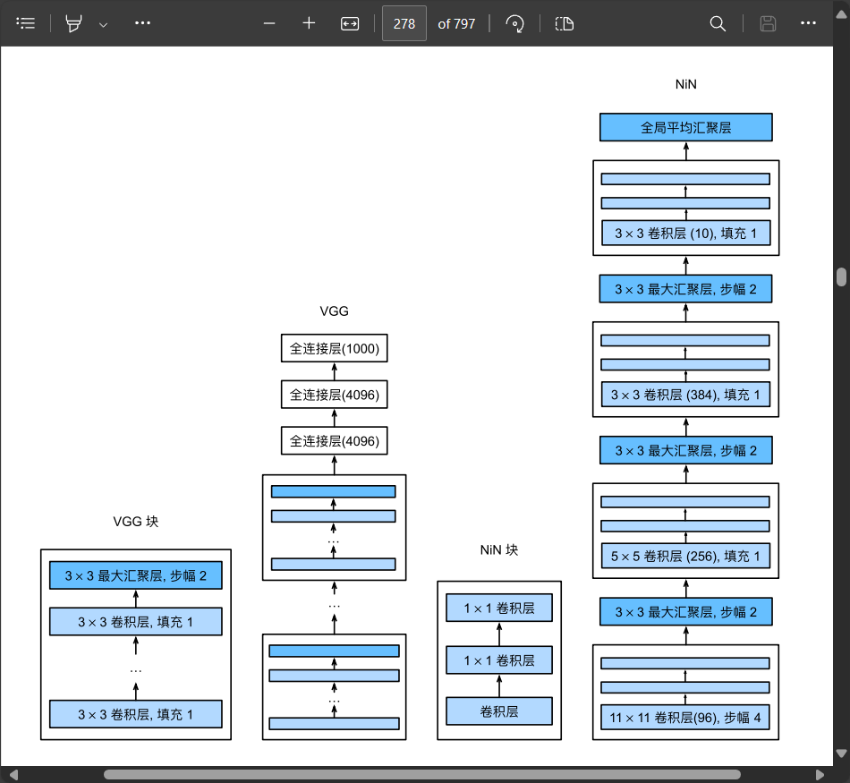
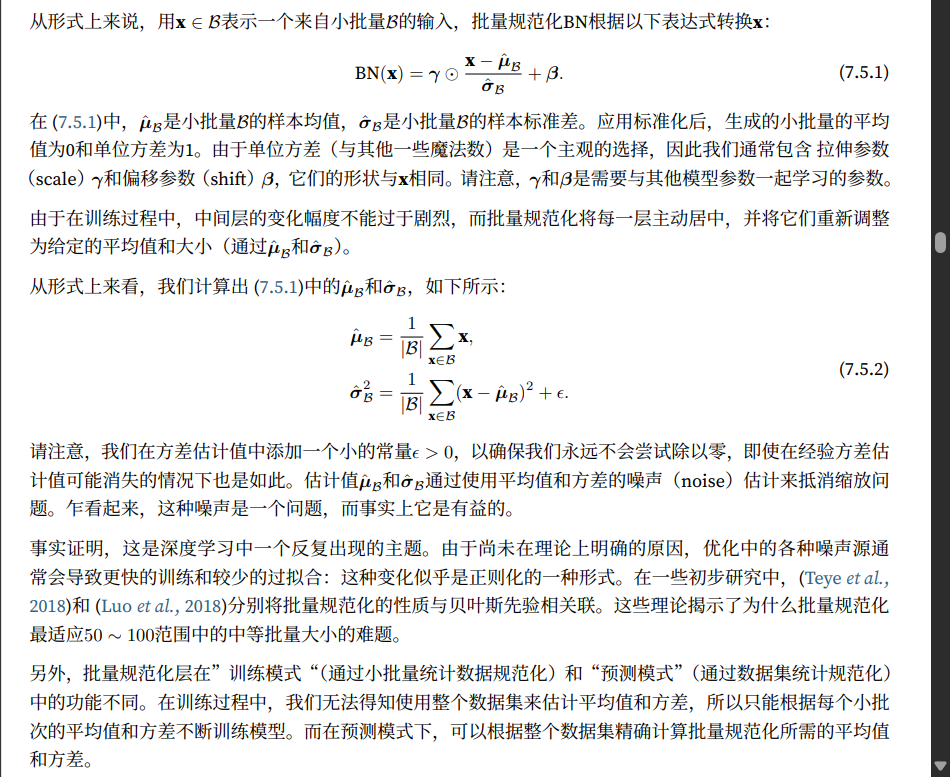

现代卷积神经网络

> ImageNet 竞赛自 2010 年以来，一直是计算机视觉中监督学习进展的指向标。 这些模型包括：
>
> - AlexNet。它是第一个在大规模视觉竞赛中击败传统计算机视觉模型的大型神经网络；
> - 使用重复块的网络（VGG）。它利用许多重复的神经网络块；
> - 网络中的网络（NiN）。它重复使用由卷积层和1 × 1卷积层（用来代替全连接层）来构建深层网络；
> - 含并行连结的网络（GoogLeNet）。它使用并行连结的网络，通过不同窗口大小的卷积层和最大汇聚层 来并行抽取信息；
> - 残差网络（ResNet）。它通过残差块构建跨层的数据通道，是计算机视觉中最流行的体系架构；
> - 稠密连接网络（DenseNet）。它的计算成本很高，但给我们带来了更好的效果。

# AlexNet



# 使用重复块的网络（VGG）

## VCG 块

经典卷积神经网络的基本组成部分是下面的这个序列： 

1. 带填充以保持分辨率的卷积层；
2. 非线性激活函数，如 ReLU；
3. 汇聚层，如最大汇聚层。



# 网络中的网络（NiN）

LeNet、AlexNet 和 VGG 都有一个共同的设计模式：通过一系列的卷积层与汇聚层来提取空间结构特征；然后通过全连接层对特征的表征进行处理。AlexNet 和 VGG 对 LeNet 的改进主要在于如何扩大和加深这两个模块。



- NiN 使用由一个卷积层和多个 1 × 1 卷积层组成的块。该块可以在卷积神经网络中使用，以允许更多的每 像素非线性。
- NiN去除了容易造成过拟合的全连接层，将它们替换为全局平均汇聚层（即在所有位置上进行求和）。该汇聚层通道数量为所需的输出数量（例如，Fashion‐MNIST 的输出为  10 ）。
- 移除全连接层可减少过拟合，同时显著减少 NiN 的参数。
- NiN 的设计影响了许多后续卷积神经网络的设计。

# 含并行连结的网络（GoogLeNet）

> 待补充

# 批量规范化



回想一下，批量规范化和其他层之间的一个关键区别是，由于批量规范化在完整的小批量上运行，因此我们不能像以前在引入其他层时那样忽略批量大小。

我们在下面讨论这两种情况：全连接层和卷积层，他们的批量规范化实现略有不同。

## 全连接层

通常，我们将批量规范化层置于全连接层中的仿射变换和激活函数之间。

设全连接层的输入为 x，权重参数和偏置参数分别为 $\mathbf{W}$ 和 $\mathbf{b}$，激活函数为$\phi$，批量规范化的运算符为 $\mathrm{BN}$。

那么，使用批量规范化的全连接层的输出的计算详情如下：
$$
\mathbf{h} = \phi(\mathrm{BN}(\mathbf{W}\mathbf{x} + \mathbf{b}) )
$$
回想一下，均值和方差是在应用变换的"相同"小批量上计算的。

## 卷积层

同样，对于卷积层，我们可以在卷积层之后和非线性激活函数之前应用批量规范化。

当卷积有多个输出通道时，我们需要对这些通道的“每个”输出执行批量规范化，每个通道都有自己的拉伸（scale）和偏移（shift）参数，这两个参数都是标量。

假设我们的小批量包含 $m$ 个样本，并且对于每个通道，卷积的输出具有高度 $p$ 和宽度 $q$。

那么对于卷积层，我们在每个输出通道的 $m \cdot p \cdot q$ 个元素上同时执行每个批量规范化。

因此，在计算平均值和方差时，我们会收集所有空间位置的值，然后在给定通道内应用相同的均值和方差，以便在每个空间位置对值进行规范化。

## 预测过程中的批量规范化

正如我们前面提到的，批量规范化在训练模式和预测模式下的行为通常不同。

首先，将训练好的模型用于预测时，我们不再需要样本均值中的噪声以及在微批次上估计每个小批次产生的样本方差了。

其次，例如，我们可能需要使用我们的模型对逐个样本进行预测。

一种常用的方法是通过移动平均估算整个训练数据集的样本均值和方差，并在预测时使用它们得到确定的输出。

可见，和暂退法一样，批量规范化层在训练模式和预测模式下的计算结果也是不一样的。

```python
import torch
from torch import nn
from d2l import torch as d2l


def batch_norm(X, gamma, beta, moving_mean, moving_var, eps, momentum):
    # 通过is_grad_enabled来判断当前模式是训练模式还是预测模式
    if not torch.is_grad_enabled():
        # 如果是在预测模式下，直接使用传入的移动平均所得的均值和方差
        X_hat = (X - moving_mean) / torch.sqrt(moving_var + eps)
    else:
        assert len(X.shape) in (2, 4)
        if len(X.shape) == 2:
            # 使用全连接层的情况，计算特征维上的均值和方差
            mean = X.mean(dim=0)
            var = ((X - mean) ** 2).mean(dim=0)
        else:
            # 使用二维卷积层的情况，计算通道维上（axis=1）的均值和方差。
            # 这里我们需要保持X的形状以便后面可以做广播运算
            mean = X.mean(dim=(0, 2, 3), keepdim=True)
            var = ((X - mean) ** 2).mean(dim=(0, 2, 3), keepdim=True)
        # 训练模式下，用当前的均值和方差做标准化
        X_hat = (X - mean) / torch.sqrt(var + eps)
        # 更新移动平均的均值和方差
        moving_mean = momentum * moving_mean + (1.0 - momentum) * mean
        moving_var = momentum * moving_var + (1.0 - momentum) * var
    Y = gamma * X_hat + beta  # 缩放和移位
    return Y, moving_mean.data, moving_var.data
```

## 使用批量规范化层的 LeNet

批量规范化是在卷积层或全连接层之后、相应的激活函数之前应用的。

```python
net = nn.Sequential(
    nn.Conv2d(1, 6, kernel_size=5), nn.BatchNorm2d(6), nn.Sigmoid(),
    nn.AvgPool2d(kernel_size=2, stride=2),
    nn.Conv2d(6, 16, kernel_size=5), nn.BatchNorm2d(16), nn.Sigmoid(),
    nn.AvgPool2d(kernel_size=2, stride=2), nn.Flatten(),
    nn.Linear(256, 120), nn.BatchNorm1d(120), nn.Sigmoid(),
    nn.Linear(120, 84), nn.BatchNorm1d(84), nn.Sigmoid(),
    nn.Linear(84, 10))
```

# 残差网络（ResNet）

