# 向量内积和外积

即点乘和叉乘

- 内积的概念对于==任意维数==的向量都适用，又称点积和数量积。已知两个向量和他们的夹角，则 $\mathbf{a}\cdot\mathbf{b}=\vert\mathbf{a}\vert\vert\mathbf{b}\vert\cos{\theta}$，这种运算得到的结果是一个标量，并不属于向量的线性运算。
- 外积是==三维向量特有的==运算。$\mathbf{a}\times\mathbf{b}=\vert\mathbf{a}\vert\vert\mathbf{b}\vert\sin{<a,b>}$，外积可以用三阶行列式表示：

$$
\left|
\begin{array}{cccc} 
    i   &   j   &   k \\ 
   x_1  &  y_1  &  z_1\\ 
   x_2  &  y_2  &  z_2 
\end{array}
\right|
$$

# 初等变换

## 初等矩阵

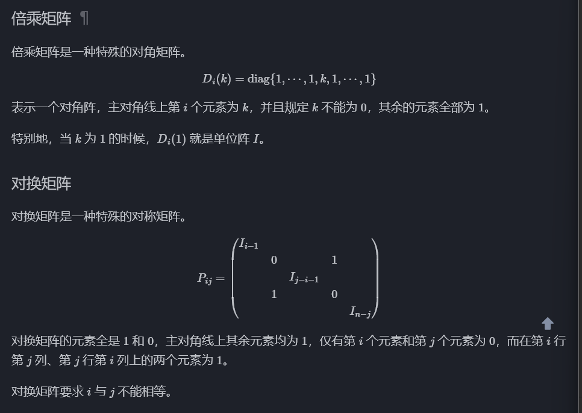

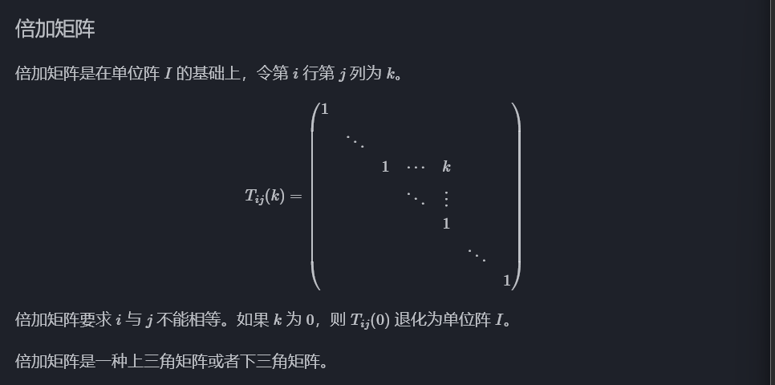

# 线性空间

> *一个集合关于某运算封闭，满足结合律、单位元与逆元则构成群。如果还满足交换律，则构成==阿贝尔群==。*
>
> *如果一个集合关于四则运算封闭，则构成==域==。*

线性空间是由向量集合 $V$，域 $\mathbb{P}$，加法运算和数乘组成的==模类代数结构==。

具体来说 $(V,+)$ 是一个阿贝尔群，$\mathbb{P}$ 是一个域。

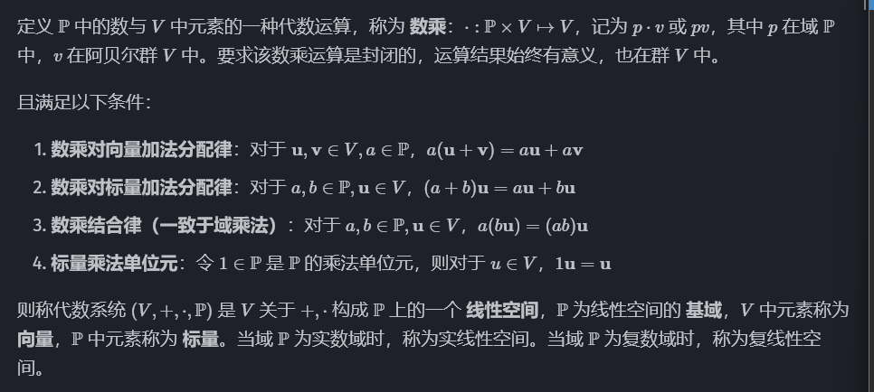

称加法群中的零元为零向量，记为 0 或 $\theta$ 。

原阿贝尔群中向量的加减法，与线性空间新定义的数乘，统称为==线性运算==。

## 线性相关和线性无关

### 定义

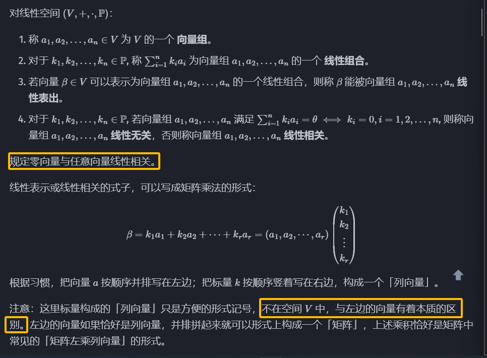

这里的线性表示也等价于，向量 $\beta$ 落在矩阵 $(a_1...,a_r)$​ 的像空间内。

### 性质

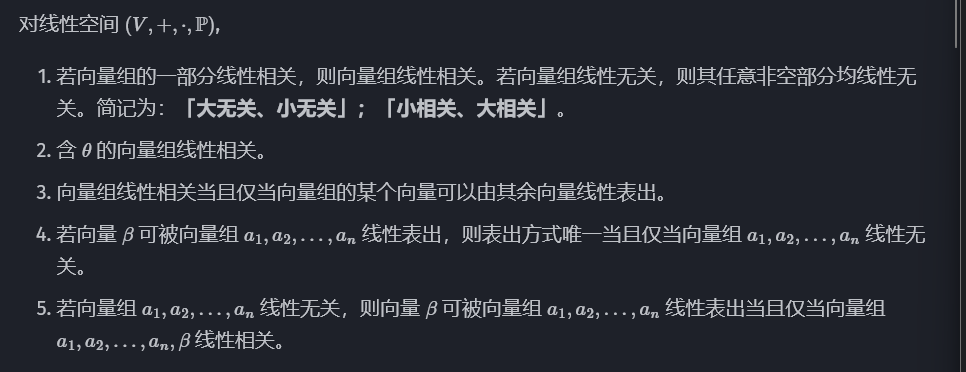

## 极大线性无关组、==秩==

> *线性相关可以理解为「多余」，说明向量组内部有的向量可以被其他向量表出，可以删去。删完了之后，将剩下极大线性无关组。*

### 定义

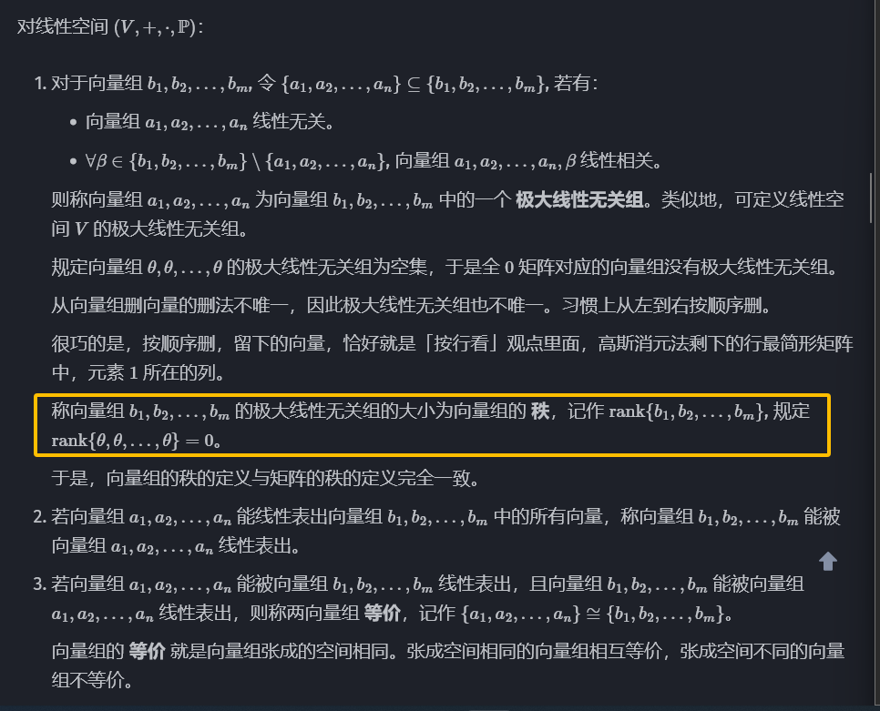

- 向量组等价比矩阵等价条件更强，不仅要求秩相同，还要求空间完全一样。因此，把两个矩阵横向拼在一起，秩不能发生变化。

- 矩阵等价仅要求秩相同，因此矩阵等价表示前一个矩阵或空间，可以通过可逆变换，到达后一个矩阵或空间。

### 性质

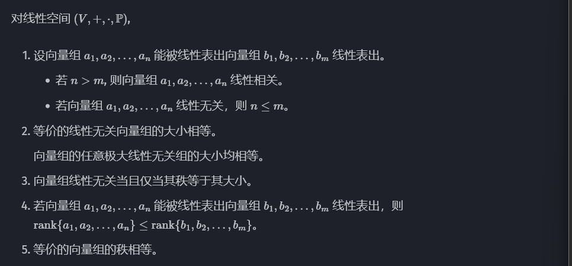

# 线性基

## 定义

线性空间 $V$ 的一个极大线性无关组为 $V$ 的一组 Hamel 基或线性基，简称基。

规定线性空间 $\{\theta\}$ 的基为空集。

$V$ 的维数 $\dim{V}$，定义为基的元素个数。

## 性质

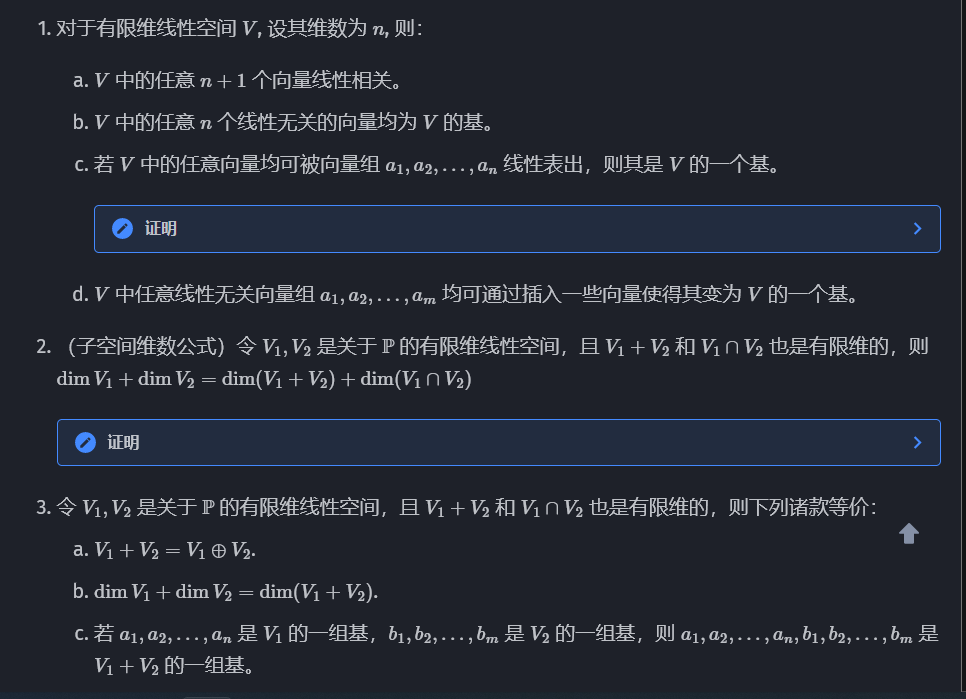

# 线性映射

## 线性映射与线性变换

### 定义

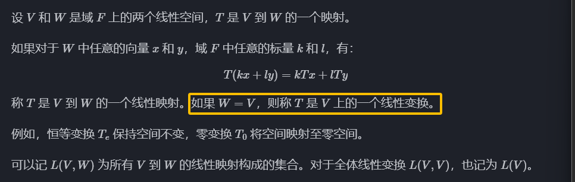

### 性质

- 线性映射将零向量映射到零向量。
- 线性映射保持线性运算形式不变，即，线性运算的线性映射，等于线性映射的线性运算。
- 线性映射保持线性相关性，即，映射前线性相关，映射后也线性相关。

但是线性映射不保持线性无关性。映射前线性无关，映射后不一定线性无关。

## 线性映射的矩阵表示

设 $V$ 的维数为 n，$V$ 的一组基为 $\alpha_1...,\alpha_n$，设 $W$ 的维数为 m，$W$ 的一组基为 $\beta_1...,\beta_n$，$T$ 是 $V$ 到 $W$ 的一个线性映射。

将每一个 $\alpha$ 经由 $T$ 映射后的向量 $\beta$ 表示：
$$
T\alpha_j=\alpha_{1j}\beta_1+\ ...\ +\alpha_{mj}\beta_n
$$

$$
T(\alpha_1,...,\alpha_n)=(T\alpha_1,...,T\alpha_n)=(\beta_1,...,\beta_m)\mathbf{A}
$$

## 线性映射的矩阵表示

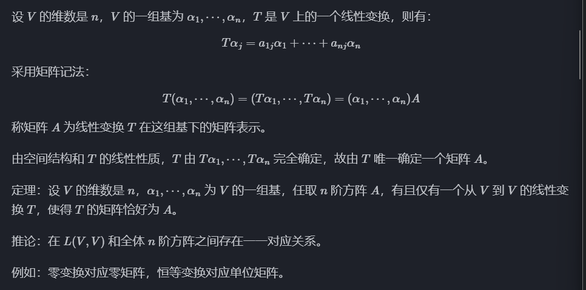

# 特征多项式

## 特征值与特征向量

### 定义

$V$ 是 $F$ 上的线性空间，==$T$ 是 $V$ 上的线性变换==。若存在 $F$ 中的 $\lambda$ 与 $V$ 中的非零向量 $\xi$，使得：
$$
T\xi=\lambda\xi
$$
则称 $\lambda$ 为 $T$ 的一个特征值，$\xi$ 为 $T$ 的属于该特征值的一个特征向量。

> *特征向量在同一直线上，在线性变换作用下保持方向不改变（压缩到零也认为是方向不改变）。特征向量不唯一，与特征向量共线的向量都是特征向量，但是==规定零向量不是特征向量==，拥有方向的向量自然是非零向量。特征向量的特征值就是它伸缩的倍数。*
>
> *在实际应用中，一般对于拥有相同特征值的特征向量，会选取一组基作为它们全体的代表。*

$\alpha_1...,\alpha_n$ 是 $V$ 的一组基，$T$ 在这组基下的矩阵为 $\mathbf{A}$ ，即：
$$
T(\alpha_1,...,\alpha_n)==(\alpha_1,...,\alpha_m)\mathbf{A}
$$
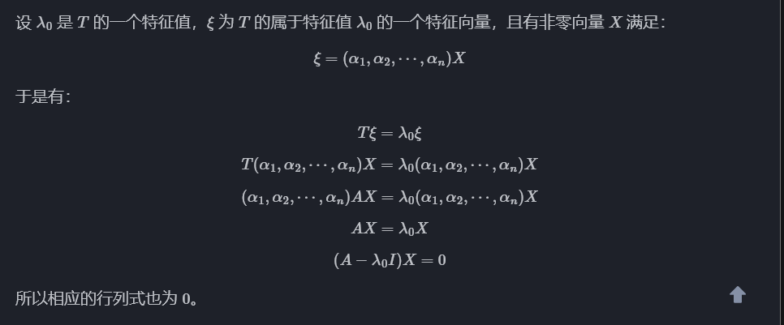

## 特征多项式

> $\mathbb{R}$ 是实数集
>
> $\mathbb{Z}$​ 是整数集
>
> $\mathbb{Q}$​ 是有理数集
>
> $\mathbb{Z^*},\mathbb{N^*}$是正整数集

考虑一个 $n\times n$ 矩阵 $A$，其中 n 是大于零的整数，$\lambda$ 是一个参量，矩阵 $\lambda I-A$ 称为 $A$ 的特征矩阵。

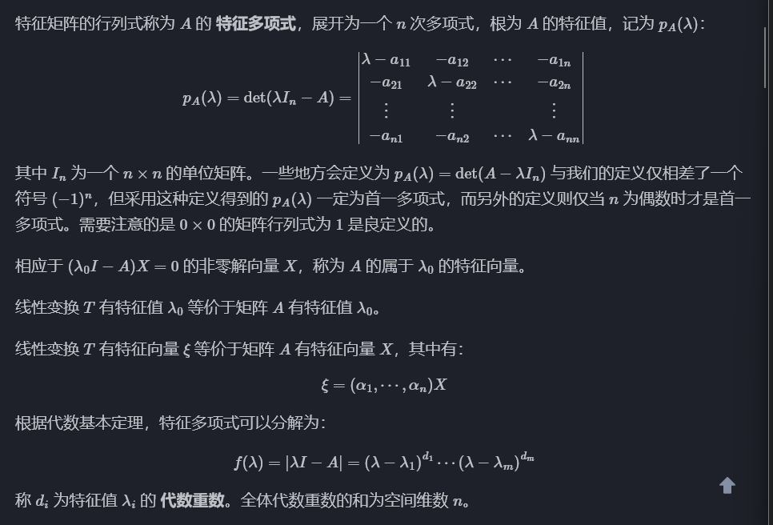

### 求解矩阵的全部特征值及特征向量

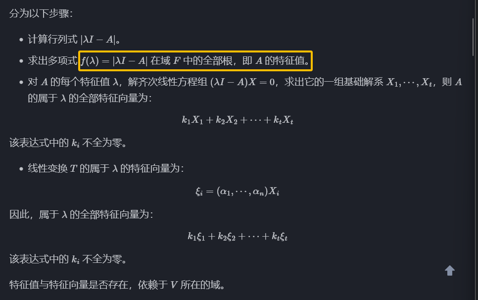

> 齐次线性方程组，即常数项均为零的线性方程组。

## 相似变换

### 定义

对于 $n\times n$ 矩阵 $A,B$，当存在 $n\times n$ 的可逆矩阵 $P$ 满足：
$$
B=P^{-1}AP
$$
则矩阵 $A,B$ 相似，记 $A\rightarrow P^{-1}AP$ 为相似变换。且两者有相同的特征多项式。

> 对于矩阵 $A$，如果存在一个同阶矩阵 $B$，使得：
> $$
> AB=BA=E
> $$
> 则称矩阵 $A$ 可逆，$B$ 是 $A$​ 的逆矩阵。
>
> 矩阵可逆的充要条件：
>
> - 行列式不为零。
> - 矩阵可以表示为有限个初等矩阵相乘。
> - 矩阵等价于 n 阶单位矩阵。
> - 矩阵的行和列向量组线性无关。
> - 齐次线性方程组 $A\mathbf{x}=0$ 仅有零解。
> - 非齐次线性方程 $A\mathbf{x}=\mathbf{b}$​ 有唯一解。
> - 矩阵的特征值都不为 0。

### 定理

相似矩阵有相同的特征多项式及特征值，反之不然。

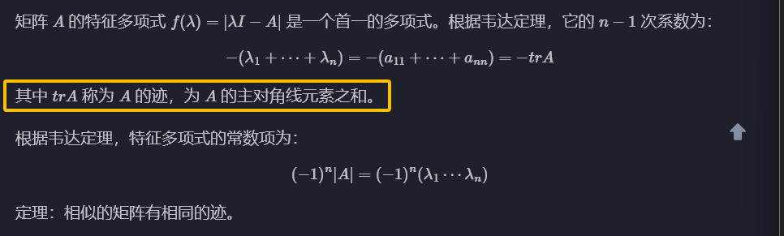

### 换位公式和舒尔引理

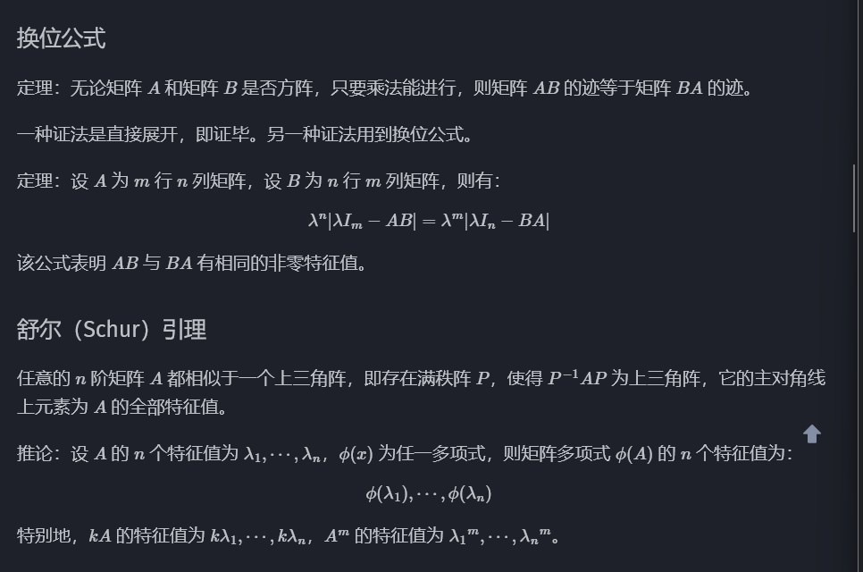

> *左乘初等矩阵后再右乘其逆矩阵即相似变换，左乘为行变换，易发现右乘即列变换。*

### 使用高斯消元进行相似变换

若能将矩阵通过相似变换变为上三角或下三角的形式，那么可以轻松求出其特征多项式。

次对角线上的元素应用变换后得到的矩阵依然可以轻松得到其特征多项式。

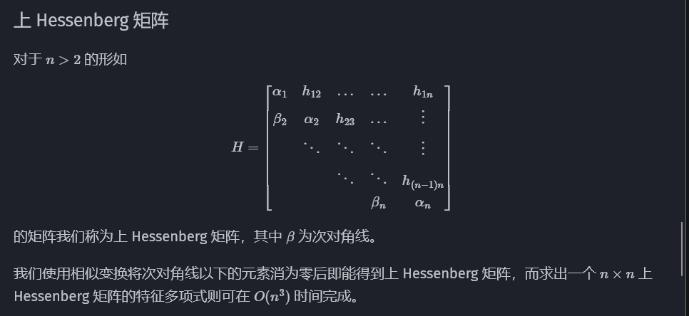

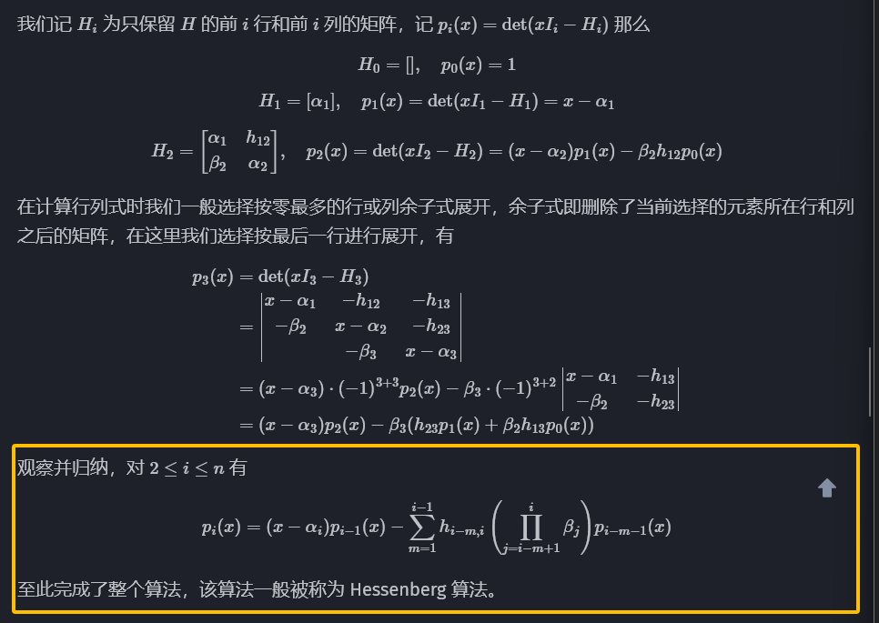
