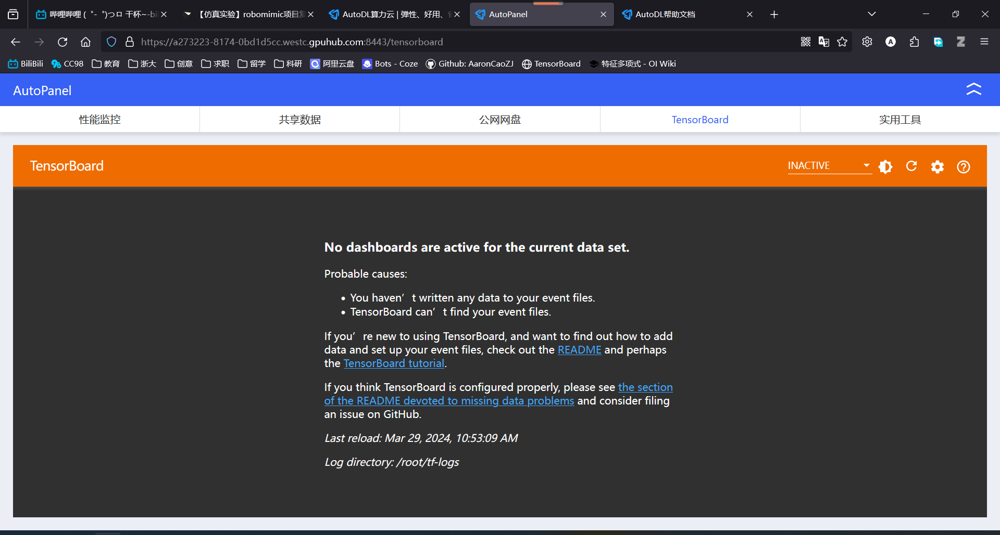
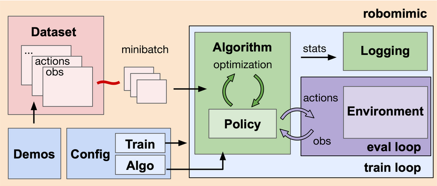
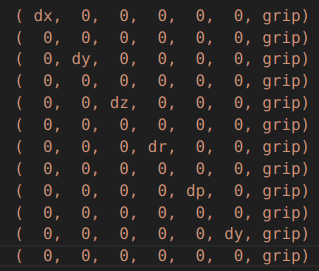
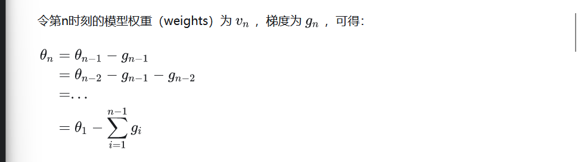
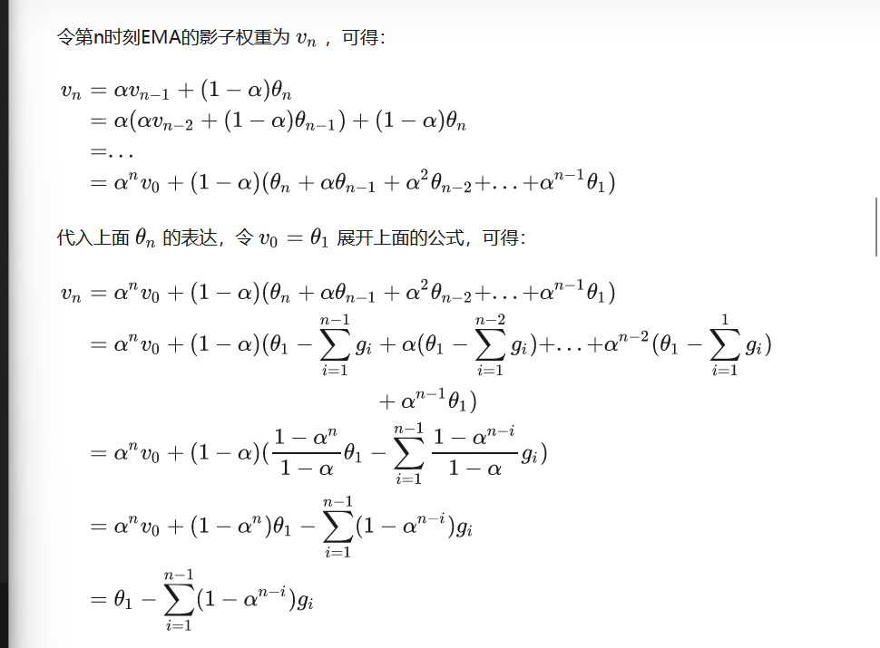
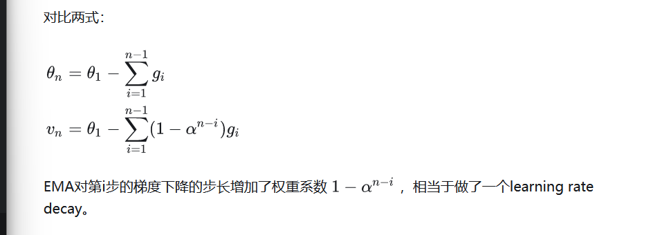
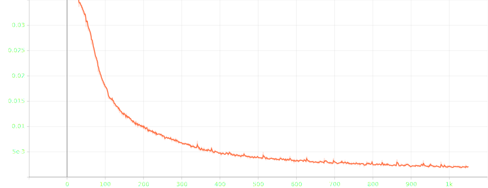
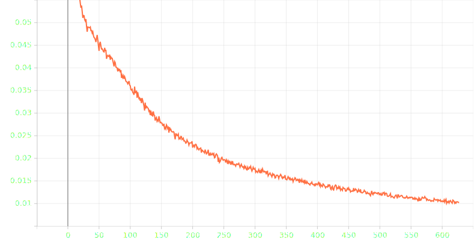
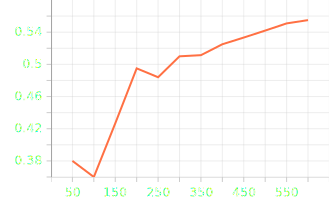
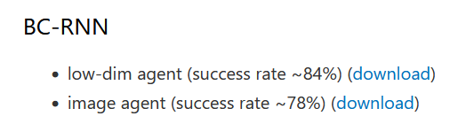

| *Robomimic v0.3* |
| ---------------- |

> `Robomimic` 是一个用于机器人从演示学习的框架，该项目提供了一系列机器人操作的演示数据和离线学习算法，可以让人们对任务和算法进行标准化测试。

> *ref:*
>
> *马浩飞博客，《【仿真实验】robomimic项目复现》,`https://www.mahaofei.com/post/8cdbc8de`* 
>
> *Robomimic 官方文档，`https://robomimic.github.io/docs/introduction/overview.html`*
>
> *Robosuite 官方文档，`https://robosuite.ai/docs/overview.html`*


# 安装

## Create and activate conda environment

```bash
conda create -n robomimic_venv python=3.8.0 -y
conda activate robomimic_venv
```

## Install PyTorch

> *注意安装 GPU 版和 CPU 版的区别*

```bash
conda install pytorch==2.0.0 torchvision==0.15.0 torchaudio==2.0.0 pytorch-cuda=11.8 -c pytorch -c nvidia
```

> *`torchversion==0.15.0`可能找不到，改为`torchversion==0.15.1`成功*

```bash
conda install pytorch==2.0.0 torchvision==0.15.1 torchaudio==2.0.0 pytorch-cuda=11.8 -c pytorch -c nvidia
```

## Install robomimic from source

```bash
cd <PATH_TO_YOUR_INSTALL_DIRECTORY>
# clone from https
git clone https://github.com/AaronCaoZJ/robomimic.git
# clone with ssh
git clone git@github.com:AaronCaoZJ/robomimic.git
cd robomimic
pip install -e .
```

## Install robosuite from source

```bash
cd <PATH_TO_YOUR_INSTALL_DIRECTORY>
# clone from https
git clone https://github.com/AaronCaoZJ/robosuite.git
# clone with ssh
git clone git@github.com:AaronCaoZJ/robosuite.git
cd robosuite
pip install -r requirements.txt
```


# Mujoco

## 阿里云`.mujoco`备份

> 安装及报错处理参考博客`https://blog.csdn.net/weixin_51844581/article/details/128454472`


# 测试运行

```bash
cd <PATH_TO_robomimic_INSTALL_DIRECTORY>
python examples/train_bc_rnn.py --debug
bash test.sh
```

> - [x] *运行过程可能持续几分钟，命令行会出现很多 passed，说明没有问题*
> - [ ] *EGL 是用于没有显示器的 server 版服务器进行渲染的时候使用的*


# 实验复现

## 下载数据集

```bash
cd <PATH_TO_robomimic_INSTALL_DIRECTORY>/robomimic/scripts
python download_datasets.py --tasks lift
```

## 可视化

```bash
python playback_dataset.py --dataset <path/to/.hdf5> --video_path <path/to/.mp4> --n 5
```

## 生成配置文件

```bash
cd <PATH_TO_robomimic_INSTALL_DIRECTORY>/robomimic
python scripts/generate_paper_configs.py --output_dir tmp/experiment_results
```

生成的配置文件默认在`robomimic/exps/paper`路径下

## 执行训练

``` bash
cd <PATH_TO_robomimic_INSTALL_DIRECTORY>/robomimic/scripts
python train.py --config <path/to/.json>
```

## 训练日志、模型和视频

After the script finishes, you can check the training outputs in the `<train.output_dir>/<experiment.name>/<date>` experiment directory:

```
config.json               # config used for this experiment
logs/                     # experiment log files
  log.txt                 # terminal output
  tb/                     # tensorboard logs
  wandb/                  # wandb logs
videos/                   # videos of robot rollouts during training
models/                   # saved model checkpoints
```

### Tensorboard

```bash
tensorboard --logdir <experiment-log-dir> --bind_all
```

### 服务器使用 Tensorboard

1. 将 Tensorboard 的 event 文件保存到`/root/tf-logs/`路径（如果您希望使用其他的 logs 文件夹，请看下方切换目录），或者将保存到其他路径的 event 文件拷贝到该路径下，然后使用 Tensorboard。

   

2. ```bash
   # 首先结束默认启动的TensorBoard进程
   ps -ef | grep tensorboard | awk '{print $2}' | xargs kill -9 
   # 在终端中执行以下命令启动TensorBoard
   tensorboard --port 6007 --logdir /path/to/your/tf-logs/direction
   ```

   




# Robomimic v0.1（CoRL 2021）数据集

## `image` 格式数据

在 [v2.0 文档](https://robomimic.github.io/docs/v0.2/datasets/robomimic_v0.1.html)中提供下载。

例如 robomimic 的 tool_hang 环境的 `image` 类型数据 demo_0 中内容如下：

- **`actions`**:`shape (n, 7)`，n 为轨迹长度，7为动作维度
- **`dones`**:` shape (n, )`，n 为轨迹长度
- obs
  - **`agentview_image`**:` shape (n, 256, 256, 3)`，agent 视角图像，分别对应(n, H, W, C)，n 为轨迹长度，H 为图像高，W 为宽，C 为图像通道数，所有图像需为 np.uint8 类型
  - **`object`**:`shape (n, 44)`，n 为轨迹长度，三个物体 base, frame, tool 的位置，姿态，相对机械臂末端的位置姿态`(pos3, quat4, to_eef_pos3, to_eef_quat4)`，共计 3x14 个值，以及 `frame_is_assembled` 与 `tool_on_frame` 两个布尔值
  - **`robot0_eef_pos`**:`shape (n, 3)`，机器人末端位置
  - **`robot0_eef_quat`**: `shape (n, 4)`，机器人末端姿态四元数
  - **`robot0_eef_vel_ang`**: `shape (n, 3)`，机器人末端角速度
  - **`robot0_eef_vel_lin`**: `shape (n, 3)`，机器人末端线速度
  - **`robot0_eye_in_hand_image`**: `shape (n, 256, 256, 3)`，机器人末端相机图像
  - **`robot0_gripper_qpos`**: `shape (n, 2)`，末端夹爪动作状态，左右两侧
  - **`robot0_gripper_qvel`**: `shape (n, 2)`，末端夹爪动作速度，左右两侧
  - **`robot0_joint_pos`**: `shape (n, 7)`，机器人各关节转角
  - **`robot0_joint_pos_cos`**: `shape (n, 7)`，机器人各关节转角 cos 值
  - **`robot0_joint_pos_sin`**: `shape (n, 7)`，机器人各关节转角 sin 值
  - **`robot0_joint_vel`**: `shape (n, 7)`，机器人各关节速度
  - **`sideview_image`**: `shape (n, 256, 256, 3)`，侧方位相机图像
- next_obs
  - 同上
- **`rewards`**: `shape (n, )`，n 为轨迹长度
- **`states`**: `shape (n, 58)`，n 为轨迹长度，58 是状态向量的维度，对于非 robosuite 数据集，应该为空

而 `low_dim` 类型的数据集的中内容与 `image` 基本相同，只是 obs 中少了所有的相机数据。


# 算法

## 创建算法

位于`~/robomimic/algo/algo.py`

> *ref：*
>
> *`https://robomimic.github.io/docs/tutorials/custom_algorithms.html`*

## BC

### 数据集批处理

获得 obs，goal_obs，期望的 action

```python
input_batch["obs"] = {k: batch["obs"][k][:, 0, :] for k in batch["obs"]}
input_batch["goal_obs"] = batch.get("goal_obs", None) # goals may not be present
input_batch["actions"] = batch["actions"][:, 0, :]
```

### 损失函数

主要分为三部分： 

1. **l2_loss 和 l1_loss：** 这两个损失函数用于计算预测动作与目标动作之间的均方误差和平滑的 $L_1$ 损失。 

2. **cos_loss：** 这个损失函数是通过余弦相似度计算预测动作和目标动作之间的方向损失。 

3. **action_loss：** ==最终的动作损失是这三个部分损失的加权和==，权重由配置文件中的参数指定。

> `action`是七维的，分别表示 xyz 变化和 rpy 变化。
>
> roll、pitch、yaw 分别对应绕 x、y、z 轴按右手系旋转。

```python
losses = OrderedDict()
a_target = batch["actions"]
actions = predictions["actions"]
losses["l2_loss"] = nn.MSELoss()(actions, a_target)
losses["l1_loss"] = nn.SmoothL1Loss()(actions, a_target)
# cosine direction loss on eef delta position
losses["cos_loss"] = LossUtils.cosine_loss(actions[..., :3], a_target[..., :3])

action_losses = [
    self.algo_config.loss.l2_weight * losses["l2_loss"],
    self.algo_config.loss.l1_weight * losses["l1_loss"],
    self.algo_config.loss.cos_weight * losses["cos_loss"],
]
action_loss = sum(action_losses)
losses["action_loss"] = action_loss
return losses
```

### 策略网络

`ActorNetwork`类


# Difussion_Policy

## requirements

```
numpy>=1.13.3
h5py
psutil
tqdm
termcolor
tensorboard
tensorboardX
imageio
imageio-ffmpeg
matplotlib
egl_probe>=1.0.1
torch
torchvision
// new
diffusers==0.11.1
```

```bash
conda install diffusers==0.11.1
conda install huggingface_hub
```

## 指数移动平均（Exponential Moving Average，EMA）

一种给予近期数据更高权重的平均方法。
$$
v_t=\beta\cdot v_{t-1}+(1-\beta)\cdot \theta_i
$$
$v_t$ 表示前 t 条的平均值，$\beta$ 是加权权重值一般是 0.9 - 0.999。

在深度学习优化过程中，$\theta_t$ 是 t 时刻的模型权重中，$v_t$ 是 t 时刻的影子权重，在梯度下降的过程中，会一直维护着这个影子权重，但是这个影子权重并不会参与训练。

> 基本的假设是，模型权重在最后的 n 步内，会在实际的最优点处抖动，所以我们取最后 n 步的平均，能使得模型更加的鲁棒。

当步数较少时，EMA 的计算会有偏差，增加一个偏差修正步骤：
$$
v_t=\frac{v_t}{1-\beta^t}
$$
显然当 t 很大时，修正近似为 1。







```python
# IMPORTANT!
# replace all BatchNorm with GroupNorm to work with EMA
# performance will tank if you forget to do this!
obs_encoder = replace_bn_with_gn(obs_encoder)
```


# 0401_汇报：diffusion_policy 训练

## Lift

### config

```json
"train": {
        "data": "/root/autodl-tmp/ROBOMIMIC_/robomimic/datasets/lift/ph/image_v141.hdf5",      "output_dir":"tmp/core/diffusion_policy/lift/ph/image/trained_models",
        "num_data_workers": 0,
        "hdf5_cache_mode": "all",
        "hdf5_use_swmr": true,
        "hdf5_load_next_obs": false,
        "hdf5_normalize_obs": false,
        "hdf5_filter_key": null,
        "seq_length": 15,
        "pad_seq_length": true,
        "frame_stack": 2,
        "pad_frame_stack": true,
        "dataset_keys": [
            "actions"
        ],
        "goal_mode": null,
        "cuda": true,
        "batch_size": 256,
        "num_epochs": 2000,
        "seed": 1
    },
```

```json
    "algo": {
        "optim_params": {
            "policy": {
                "learning_rate": {
                    "initial": 0.0001,
                    "decay_factor": 0.1,
                    "epoch_schedule": []
                },
                "regularization": {
                    "L2": 0.0
                }
            }
        },
        "horizon": {
            "observation_horizon": 2,
            "action_horizon": 8,
            "prediction_horizon": 16
        },
        "unet": {
            "enabled": true,
            "diffusion_step_embed_dim": 256,
            "down_dims": [256,512,1024],
            "kernel_size": 5,
            "n_groups": 8
        },
        "ema": {
            "enabled": true,
            "power": 0.75
        },
        "ddpm": {
            "enabled": true,
            "num_train_timesteps": 100,
            "num_inference_timesteps": 100,
            "beta_schedule": "squaredcos_cap_v2",
            "clip_sample": true,
            "prediction_type": "epsilon"
        }
    },
```

选用 obs 中的末端执行器摄像头及智能体完整视角作为图像输入。

```json
"observation": {
        "modalities": {
            "obs": {
                "low_dim": [
                ],
                "rgb": [
                    "agentview_image",
                    "robot0_eye_in_hand_image"
                ],
                "depth": [],
                "scan": []
            },
            "goal": {
                "low_dim": [],
                "rgb": [],
                "depth": [],
                "scan": []
            }
        },
```

rgb encoder

```json
"rgb": {
                "core_class": "VisualCore",
                "core_kwargs": {
                    "feature_dimension": 64,
                    "backbone_class": "ResNet18Conv",
                    "backbone_kwargs": {
                        "pretrained": false,
                        "input_coord_conv": false
                    },
                    "pool_class": "SpatialSoftmax",
                    "pool_kwargs": {
                        "num_kp": 32,
                        "learnable_temperature": false,
                        "temperature": 1.0,
                        "noise_std": 0.0
                    }
                },
                "obs_randomizer_class": "CropRandomizer",
                "obs_randomizer_kwargs": {
                    "crop_height": 76,
                    "crop_width": 76,
                    "num_crops": 1,
                    "pos_enc": false
                }
            },
```

### train_loss



epoch > 900 时，loss 大致在 0.0019 到 0.0021 间波动。

### task_rollout

<video src="D:/Folder for ZJU/Folder for Academic/毕业设计/组会汇报/Lift_epoch_1000.mp4"></video>

```
Epoch 500 Rollouts took 12.730176005363464s (avg) with results:
Env: Lift
{
    "Horizon": 44.46,
    "Return": 1.0,
    "Success_Rate": 1.0,
    "Time_Episode": 10.608480004469554,
    "time": 12.730176005363464
}
```

## Square

### train_loss



训练到 epoch = 650，loss 似乎还有下降趋势，根据官方 benchmarks `num_epoch` 一般在 2000

已花费24h+，==考虑调整初始学习率等方法加速学习==

### task_rollout

1. epoch_50

<video src="D:/Folder for ZJU/Folder for Academic/毕业设计/组会汇报/NutAssemblySquare_epoch_50.mp4"></video>

2. epoch_600

<video src="D:/Folder for ZJU/Folder for Academic/毕业设计/组会汇报/NutAssemblySquare_epoch_600.mp4"></video>

### success_rate



在该任务下，官方 benchmark，即 bc_rnn 的最佳实践：



## 难点

1. 创建自己的更符合“家居”环境的任务环境收集数据集效率低，尝试寻找已经打包好的其他数据集，在 robomimic 中测试，实在没找到自行收集人为数据

2. 加速模型训练，了解示教的欠佳数据是否影响训练
