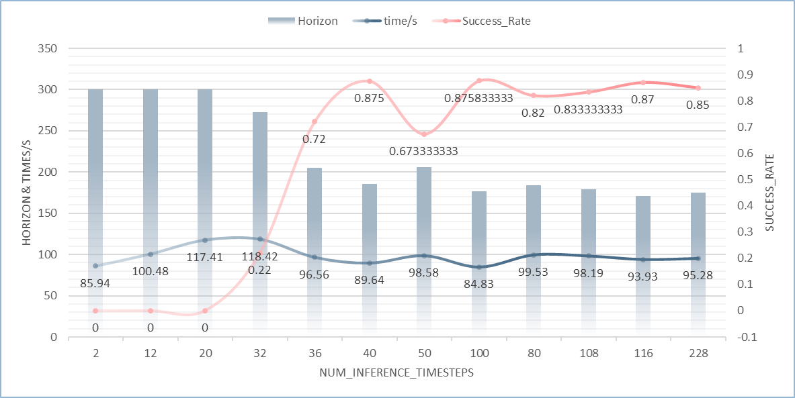

# Rollout Experiments

## Config

```json
{
    "algo_name": "diffusion_policy",
    "experiment": {
        "name": "test",
        "validate": false,
        "logging": {
            "terminal_output_to_txt": true,
            "log_tb": true,
            "log_wandb": false,
            "wandb_proj_name": "debug"
        },
        "save": {
            "enabled": true,
            "every_n_seconds": null,
            "every_n_epochs": 50,
            "epochs": [],
            "on_best_validation": false,
            "on_best_rollout_return": false,
            "on_best_rollout_success_rate": true
        },
        "epoch_every_n_steps": 100,
        "validation_epoch_every_n_steps": 10,
        "env": null,
        "additional_envs": null,
        "render": false,
        "render_video": true,
        "keep_all_videos": false,
        "video_skip": 5,
        "rollout": {
            "enabled": true,
            "n": 50,
            "horizon": 400,
            "rate": 50,
            "warmstart": 0,
            "terminate_on_success": true
        },
        "env_meta_update_dict": {}
    },
    "train": {
        "data": "/root/autodl-tmp/ROBOMIMIC_/robomimic/datasets/square/ph/image.hdf5",
        "output_dir": "../diffusion_policy_trained_models",
        "num_data_workers": 0,
        "hdf5_cache_mode": "all",
        "hdf5_use_swmr": true,
        "hdf5_load_next_obs": false,
        "hdf5_normalize_obs": false,
        "hdf5_filter_key": null,
        "hdf5_validation_filter_key": null,
        "seq_length": 15,
        "pad_seq_length": true,
        "frame_stack": 2,
        "pad_frame_stack": true,
        "dataset_keys": [],
        "action_keys": {
            "action_dict/abs_pos": {
                "normalization": "min_max"
            },
            "action_dict/abs_rot_6d": {
                "normalization": "min_max",
                "format": "rot_6d"
            },
            "action_dict/gripper": {
                "normalization": "min_max"
            }
        },
        "action_config": {
            "action_dict/cartesian_position": {
                "normalization": "min_max"
            },
            "action_dict/abs_pos": {
                "normalization": "min_max"
            },
            "action_dict/abs_rot_6d": {
                "normalization": "min_max",
                "format": "rot_6d"
            },
            "action_dict/abs_rot_axis_angle": {
                "normalization": "min_max",
                "format": "rot_axis_angle"
            },
            "action_dict/gripper": {
                "normalization": "min_max"
            },
            "action_dict/gripper_position": {
                "normalization": "min_max"
            },
            "action_dict/cartesian_velocity": {
                "normalization": null
            },
            "action_dict/gripper_velocity": {
                "normalization": null
            }
        },
        "goal_mode": null,
        "cuda": true,
        "batch_size": 64,
        "num_epochs": 2000,
        "seed": 1,
        "data_format": "robomimic"
    },
    "algo": {
        "optim_params": {
            "policy": {
                "learning_rate": {
                    "initial": 0.0001,
                    "decay_factor": 0.1,
                    "epoch_schedule": []
                },
                "regularization": {
                    "L2": 0.0
                }
            }
        },
        "horizon": {
            "observation_horizon": 2,
            "action_horizon": 8,
            "prediction_horizon": 16
        },
        "unet": {
            "enabled": true,
            "diffusion_step_embed_dim": 128,
            "down_dims": [
                256,
                512,
                1024
            ],
            "kernel_size": 5,
            "n_groups": 8
        },
        "ema": {
            "enabled": true,
            "power": 0.75
        },
        "ddpm": {
            "enabled": true,
            "num_train_timesteps": 100,
            "num_inference_timesteps": 100,
            "beta_schedule": "squaredcos_cap_v2",
            "clip_sample": true,
            "prediction_type": "epsilon"
        },
        "ddim": {
            "enabled": false,
            "num_train_timesteps": 100,
            "num_inference_timesteps": 10,
            "beta_schedule": "squaredcos_cap_v2",
            "clip_sample": true,
            "set_alpha_to_one": true,
            "steps_offset": 0,
            "prediction_type": "epsilon"
        }
    },
    "observation": {
        "modalities": {
            "obs": {
                "low_dim": [
                    "robot0_eef_pos",
                    "robot0_eef_quat",
                    "robot0_gripper_qpos",
                    "object"
                ],
                "rgb": [
                    "agentview_image",
                    "robot0_eye_in_hand_image"
                ],
                "depth": [],
                "scan": []
            },
            "goal": {
                "low_dim": [],
                "rgb": [],
                "depth": [],
                "scan": []
            }
        },
        "encoder": {
            "low_dim": {
                "core_class": null,
                "core_kwargs": {},
                "obs_randomizer_class": null,
                "obs_randomizer_kwargs": {}
            },
            "rgb": {
                "core_class": "VisualCore",
                "core_kwargs": {
                    "feature_dimension": 64,
                    "backbone_class": "ResNet18Conv",
                    "backbone_kwargs": {
                        "pretrained": false,
                        "input_coord_conv": false
                    },
                    "pool_class": "SpatialSoftmax",
                    "pool_kwargs": {
                        "num_kp": 32,
                        "learnable_temperature": false,
                        "temperature": 1.0,
                        "noise_std": 0.0
                    }
                },
                "obs_randomizer_class": "CropRandomizer",
                "obs_randomizer_kwargs": {
                    "crop_height": 76,
                    "crop_width": 76,
                    "num_crops": 1,
                    "pos_enc": false
                }
            },
            "depth": {
                "core_class": "VisualCore",
                "core_kwargs": {},
                "obs_randomizer_class": null,
                "obs_randomizer_kwargs": {}
            },
            "scan": {
                "core_class": "ScanCore",
                "core_kwargs": {},
                "obs_randomizer_class": null,
                "obs_randomizer_kwargs": {}
            }
        }
    },
    "meta": {
        "hp_base_config_file": null,
        "hp_keys": [],
        "hp_values": []
    }
}
```

## Env

```json
env=NutAssemblySquare
{
    "camera_depths": false,
    "camera_heights": 84,
    "camera_names": [
        "agentview",
        "robot0_eye_in_hand"
    ],
    "camera_widths": 84,
    "control_freq": 20,
    "controller_configs": {
        "control_delta": true,
        "damping": 1,
        "damping_limits": [
            0,
            10
        ],
        "impedance_mode": "fixed",
        "input_max": 1,
        "input_min": -1,
        "interpolation": null,
        "kp": 150,
        "kp_limits": [
            0,
            300
        ],
        "orientation_limits": null,
        "output_max": [
            0.05,
            0.05,
            0.05,
            0.5,
            0.5,
            0.5
        ],
        "output_min": [
            -0.05,
            -0.05,
            -0.05,
            -0.5,
            -0.5,
            -0.5
        ],
        "position_limits": null,
        "ramp_ratio": 0.2,
        "type": "OSC_POSE",
        "uncouple_pos_ori": true
    },
    "has_offscreen_renderer": true,
    "has_renderer": false,
    "ignore_done": true,
    "render_gpu_device_id": 0,
    "reward_shaping": false,
    "robots": [
        "Panda"
    ],
    "use_camera_obs": true,
    "use_object_obs": true
}
```

## PolicyNet

```bash
DiffusionPolicyUNet (
  ModuleDict(
    (policy): ModuleDict(
      (obs_encoder): ObservationGroupEncoder(
          group=obs
          ObservationEncoder(
              Key(
                  name=agentview_image
                  shape=[3, 84, 84]
                  modality=rgb
                  randomizer=CropRandomizer(input_shape=[3, 84, 84], crop_size=[76, 76], num_crops=1)
                  net=VisualCore(
                    input_shape=[3, 76, 76]
                    output_shape=[64]
                    backbone_net=ResNet18Conv(input_channel=3, input_coord_conv=False)
                    pool_net=SpatialSoftmax(num_kp=32, temperature=1.0, noise=0.0)
                  )
                  sharing_from=None
              )
              Key(
                  name=object
                  shape=[14]
                  modality=low_dim
                  randomizer=None
                  net=None
                  sharing_from=None
              )
              Key(
                  name=robot0_eef_pos
                  shape=[3]
                  modality=low_dim
                  randomizer=None
                  net=None
                  sharing_from=None
              )
              Key(
                  name=robot0_eef_quat
                  shape=[4]
                  modality=low_dim
                  randomizer=None
                  net=None
                  sharing_from=None
              )
              Key(
                  name=robot0_eye_in_hand_image
                  shape=[3, 84, 84]
                  modality=rgb
                  randomizer=CropRandomizer(input_shape=[3, 84, 84], crop_size=[76, 76], num_crops=1)
                  net=VisualCore(
                    input_shape=[3, 76, 76]
                    output_shape=[64]
                    backbone_net=ResNet18Conv(input_channel=3, input_coord_conv=False)
                    pool_net=SpatialSoftmax(num_kp=32, temperature=1.0, noise=0.0)
                  )
                  sharing_from=None
              )
              Key(
                  name=robot0_gripper_qpos
                  shape=[2]
                  modality=low_dim
                  randomizer=None
                  net=None
                  sharing_from=None
              )
              output_shape=[151]
          )
      )
      (noise_pred_net): ConditionalUnet1D(
        (mid_modules): ModuleList(
          (0-1): 2 x ConditionalResidualBlock1D(
            (blocks): ModuleList(
              (0-1): 2 x Conv1dBlock(
                (block): Sequential(
                  (0): Conv1d(1024, 1024, kernel_size=(5,), stride=(1,), padding=(2,))
                  (1): GroupNorm(8, 1024, eps=1e-05, affine=True)
                  (2): Mish()
                )
              )
            )
            (cond_encoder): Sequential(
              (0): Mish()
              (1): Linear(in_features=558, out_features=2048, bias=True)
              (2): Unflatten(dim=-1, unflattened_size=(-1, 1))
            )
            (residual_conv): Identity()
          )
        )
        (diffusion_step_encoder): Sequential(
          (0): SinusoidalPosEmb()
          (1): Linear(in_features=256, out_features=1024, bias=True)
          (2): Mish()
          (3): Linear(in_features=1024, out_features=256, bias=True)
        )
        (up_modules): ModuleList(
          (0): ModuleList(
            (0): ConditionalResidualBlock1D(
              (blocks): ModuleList(
                (0): Conv1dBlock(
                  (block): Sequential(
                    (0): Conv1d(2048, 512, kernel_size=(5,), stride=(1,), padding=(2,))
                    (1): GroupNorm(8, 512, eps=1e-05, affine=True)
                    (2): Mish()
                  )
                )
                (1): Conv1dBlock(
                  (block): Sequential(
                    (0): Conv1d(512, 512, kernel_size=(5,), stride=(1,), padding=(2,))
                    (1): GroupNorm(8, 512, eps=1e-05, affine=True)
                    (2): Mish()
                  )
                )
              )
              (cond_encoder): Sequential(
                (0): Mish()
                (1): Linear(in_features=558, out_features=1024, bias=True)
                (2): Unflatten(dim=-1, unflattened_size=(-1, 1))
              )
              (residual_conv): Conv1d(2048, 512, kernel_size=(1,), stride=(1,))
            )
            (1): ConditionalResidualBlock1D(
              (blocks): ModuleList(
                (0-1): 2 x Conv1dBlock(
                  (block): Sequential(
                    (0): Conv1d(512, 512, kernel_size=(5,), stride=(1,), padding=(2,))
                    (1): GroupNorm(8, 512, eps=1e-05, affine=True)
                    (2): Mish()
                  )
                )
              )
              (cond_encoder): Sequential(
                (0): Mish()
                (1): Linear(in_features=558, out_features=1024, bias=True)
                (2): Unflatten(dim=-1, unflattened_size=(-1, 1))
              )
              (residual_conv): Identity()
            )
            (2): Upsample1d(
              (conv): ConvTranspose1d(512, 512, kernel_size=(4,), stride=(2,), padding=(1,))
            )
          )
          (1): ModuleList(
            (0): ConditionalResidualBlock1D(
              (blocks): ModuleList(
                (0): Conv1dBlock(
                  (block): Sequential(
                    (0): Conv1d(1024, 256, kernel_size=(5,), stride=(1,), padding=(2,))
                    (1): GroupNorm(8, 256, eps=1e-05, affine=True)
                    (2): Mish()
                  )
                )
                (1): Conv1dBlock(
                  (block): Sequential(
                    (0): Conv1d(256, 256, kernel_size=(5,), stride=(1,), padding=(2,))
                    (1): GroupNorm(8, 256, eps=1e-05, affine=True)
                    (2): Mish()
                  )
                )
              )
              (cond_encoder): Sequential(
                (0): Mish()
                (1): Linear(in_features=558, out_features=512, bias=True)
                (2): Unflatten(dim=-1, unflattened_size=(-1, 1))
              )
              (residual_conv): Conv1d(1024, 256, kernel_size=(1,), stride=(1,))
            )
            (1): ConditionalResidualBlock1D(
              (blocks): ModuleList(
                (0-1): 2 x Conv1dBlock(
                  (block): Sequential(
                    (0): Conv1d(256, 256, kernel_size=(5,), stride=(1,), padding=(2,))
                    (1): GroupNorm(8, 256, eps=1e-05, affine=True)
                    (2): Mish()
                  )
                )
              )
              (cond_encoder): Sequential(
                (0): Mish()
                (1): Linear(in_features=558, out_features=512, bias=True)
                (2): Unflatten(dim=-1, unflattened_size=(-1, 1))
              )
              (residual_conv): Identity()
            )
            (2): Upsample1d(
              (conv): ConvTranspose1d(256, 256, kernel_size=(4,), stride=(2,), padding=(1,))
            )
          )
        )
        (down_modules): ModuleList(
          (0): ModuleList(
            (0): ConditionalResidualBlock1D(
              (blocks): ModuleList(
                (0): Conv1dBlock(
                  (block): Sequential(
                    (0): Conv1d(10, 256, kernel_size=(5,), stride=(1,), padding=(2,))
                    (1): GroupNorm(8, 256, eps=1e-05, affine=True)
                    (2): Mish()
                  )
                )
                (1): Conv1dBlock(
                  (block): Sequential(
                    (0): Conv1d(256, 256, kernel_size=(5,), stride=(1,), padding=(2,))
                    (1): GroupNorm(8, 256, eps=1e-05, affine=True)
                    (2): Mish()
                  )
                )
              )
              (cond_encoder): Sequential(
                (0): Mish()
                (1): Linear(in_features=558, out_features=512, bias=True)
                (2): Unflatten(dim=-1, unflattened_size=(-1, 1))
              )
              (residual_conv): Conv1d(10, 256, kernel_size=(1,), stride=(1,))
            )
            (1): ConditionalResidualBlock1D(
              (blocks): ModuleList(
                (0-1): 2 x Conv1dBlock(
                  (block): Sequential(
                    (0): Conv1d(256, 256, kernel_size=(5,), stride=(1,), padding=(2,))
                    (1): GroupNorm(8, 256, eps=1e-05, affine=True)
                    (2): Mish()
                  )
                )
              )
              (cond_encoder): Sequential(
                (0): Mish()
                (1): Linear(in_features=558, out_features=512, bias=True)
                (2): Unflatten(dim=-1, unflattened_size=(-1, 1))
              )
              (residual_conv): Identity()
            )
            (2): Downsample1d(
              (conv): Conv1d(256, 256, kernel_size=(3,), stride=(2,), padding=(1,))
            )
          )
          (1): ModuleList(
            (0): ConditionalResidualBlock1D(
              (blocks): ModuleList(
                (0): Conv1dBlock(
                  (block): Sequential(
                    (0): Conv1d(256, 512, kernel_size=(5,), stride=(1,), padding=(2,))
                    (1): GroupNorm(8, 512, eps=1e-05, affine=True)
                    (2): Mish()
                  )
                )
                (1): Conv1dBlock(
                  (block): Sequential(
                    (0): Conv1d(512, 512, kernel_size=(5,), stride=(1,), padding=(2,))
                    (1): GroupNorm(8, 512, eps=1e-05, affine=True)
                    (2): Mish()
                  )
                )
              )
              (cond_encoder): Sequential(
                (0): Mish()
                (1): Linear(in_features=558, out_features=1024, bias=True)
                (2): Unflatten(dim=-1, unflattened_size=(-1, 1))
              )
              (residual_conv): Conv1d(256, 512, kernel_size=(1,), stride=(1,))
            )
            (1): ConditionalResidualBlock1D(
              (blocks): ModuleList(
                (0-1): 2 x Conv1dBlock(
                  (block): Sequential(
                    (0): Conv1d(512, 512, kernel_size=(5,), stride=(1,), padding=(2,))
                    (1): GroupNorm(8, 512, eps=1e-05, affine=True)
                    (2): Mish()
                  )
                )
              )
              (cond_encoder): Sequential(
                (0): Mish()
                (1): Linear(in_features=558, out_features=1024, bias=True)
                (2): Unflatten(dim=-1, unflattened_size=(-1, 1))
              )
              (residual_conv): Identity()
            )
            (2): Downsample1d(
              (conv): Conv1d(512, 512, kernel_size=(3,), stride=(2,), padding=(1,))
            )
          )
          (2): ModuleList(
            (0): ConditionalResidualBlock1D(
              (blocks): ModuleList(
                (0): Conv1dBlock(
                  (block): Sequential(
                    (0): Conv1d(512, 1024, kernel_size=(5,), stride=(1,), padding=(2,))
                    (1): GroupNorm(8, 1024, eps=1e-05, affine=True)
                    (2): Mish()
                  )
                )
                (1): Conv1dBlock(
                  (block): Sequential(
                    (0): Conv1d(1024, 1024, kernel_size=(5,), stride=(1,), padding=(2,))
                    (1): GroupNorm(8, 1024, eps=1e-05, affine=True)
                    (2): Mish()
                  )
                )
              )
              (cond_encoder): Sequential(
                (0): Mish()
                (1): Linear(in_features=558, out_features=2048, bias=True)
                (2): Unflatten(dim=-1, unflattened_size=(-1, 1))
              )
              (residual_conv): Conv1d(512, 1024, kernel_size=(1,), stride=(1,))
            )
            (1): ConditionalResidualBlock1D(
              (blocks): ModuleList(
                (0-1): 2 x Conv1dBlock(
                  (block): Sequential(
                    (0): Conv1d(1024, 1024, kernel_size=(5,), stride=(1,), padding=(2,))
                    (1): GroupNorm(8, 1024, eps=1e-05, affine=True)
                    (2): Mish()
                  )
                )
              )
              (cond_encoder): Sequential(
                (0): Mish()
                (1): Linear(in_features=558, out_features=2048, bias=True)
                (2): Unflatten(dim=-1, unflattened_size=(-1, 1))
              )
              (residual_conv): Identity()
            )
            (2): Identity()
          )
        )
        (final_conv): Sequential(
          (0): Conv1dBlock(
            (block): Sequential(
              (0): Conv1d(256, 256, kernel_size=(5,), stride=(1,), padding=(2,))
              (1): GroupNorm(8, 256, eps=1e-05, affine=True)
              (2): Mish()
            )
          )
          (1): Conv1d(256, 10, kernel_size=(1,), stride=(1,))
        )
      )
    )
  )
)
```

## num_inference_timesteps

### set 2

```bash
Average Rollout Stats
{
    "Return": 0.0,
    "Horizon": 300.0,
    "Success_Rate": 0.0,
    "Exception_Rate": 0.0,
    "time": 85.93658829728763,
    "Num_Success": 0.0,
    "Time_Episode": 34.37463531891505,
    "Num_Episode": 24
}
```

### set 12

```bash
Average Rollout Stats
{
    "Return": 0.0,
    "Horizon": 300.0,
    "Success_Rate": 0.0,
    "Exception_Rate": 0.0,
    "time": 100.47921441992123,
    "Num_Success": 0.0,
    "Time_Episode": 40.191685767968494,
    "Num_Episode": 24
}
```

### set 20

```bash
Average Rollout Stats
{
    "Return": 0.0,
    "Horizon": 300.0,
    "Success_Rate": 0.0,
    "Exception_Rate": 0.0,
    "time": 117.41130375862122,
    "Num_Success": 0.0,
    "Time_Episode": 46.96452150344849,
    "Num_Episode": 24
}
```

### set 32

```bash
Average Rollout Stats
{
    "Return": 0.22,
    "Horizon": 272.54,
    "Success_Rate": 0.22,
    "Exception_Rate": 0.0,
    "time": 118.42190825462342,
    "Num_Success": 11.0,
    "Time_Episode": 98.68492354551951,
    "Num_Episode": 50
}
```

### set 36

```bash
Average Rollout Stats
{
    "Return": 0.72,
    "Horizon": 205.48,
    "Success_Rate": 0.72,
    "Exception_Rate": 0.0,
    "time": 96.5551275253296,
    "Num_Success": 36.0,
    "Time_Episode": 80.46260627110799,
    "Num_Episode": 50
}
```

### set 40

```bash
Average Rollout Stats
{
    "Return": 0.875,
    "Horizon": 185.33333333333334,
    "Success_Rate": 0.875,
    "Exception_Rate": 0.0,
    "time": 89.6403706073761,
    "Num_Success": 21.0,
    "Time_Episode": 35.85614824295044,
    "Num_Episode": 24
}
```

### set 50

```bash
manual_run_1
Average Rollout Stats
{
    "Return": 0.6666666666666666,
    "Horizon": 206.45833333333334,
    "Success_Rate": 0.6666666666666666,
    "Exception_Rate": 0.0,
    "time": 99.76922650138538,
    "Num_Success": 16.0,
    "Time_Episode": 39.90769060055415,
    "Num_Episode": 24
}
```

```bash
manual_run_2
Average Rollout Stats
{
    "Return": 0.68,
    "Horizon": 205.04,
    "Success_Rate": 0.68,
    "Exception_Rate": 0.0,
    "time": 97.3878582906723,
    "Num_Success": 34.0,
    "Time_Episode": 81.15654857556025,
    "Num_Episode": 50
}
```

### set 80

```bash
Average Rollout Stats
{
    "Return": 0.82,
    "Horizon": 183.96,
    "Success_Rate": 0.82,
    "Exception_Rate": 0.0,
    "time": 99.52504521846771,
    "Num_Success": 41.0,
    "Time_Episode": 82.93753768205643,
    "Num_Episode": 50
}
```

### set 100

```bash
manual_run_1
Average Rollout Stats
{
    "Return": 0.7916666666666666,
    "Horizon": 189.16666666666666,
    "Success_Rate": 0.7916666666666666,
    "Exception_Rate": 0.0,
    "time": 102.5715760787328,
    "Num_Success": 19.0,
    "Time_Episode": 41.02863043149312,
    "Num_Episode": 24
}
```

```bash
Epoch 1550 Rollouts took 71.46932230472565s (avg) with results:
Env: NutAssemblySquare
{
    "Exception_Rate": 0.0,
    "Horizon": 163.82,
    "Return": 0.96,
    "Success_Rate": 0.96,
    "Time_Episode": 59.557768587271376,
    "time": 71.46932230472565
}
```

### set 108

```bash
manual_run_1
Average Rollout Stats
{
    "Return": 0.8333333333333334,
    "Horizon": 179.375,
    "Success_Rate": 0.8333333333333334,
    "Exception_Rate": 0.0,
    "time": 98.19133006532986,
    "Num_Success": 20.0,
    "Time_Episode": 39.276532026131946,
    "Num_Episode": 24
}
```

### set 116

```bash
Average Rollout Stats
{
    "Return": 0.87,
    "Horizon": 170.95,
    "Success_Rate": 0.87,
    "Exception_Rate": 0.0,
    "time": 93.92832707166671,
    "Num_Success": 87.0,
    "Time_Episode": 156.5472117861112,
    "Num_Episode": 100
}
```

### set 228

```bash
Average Rollout Stats
{
    "Return": 0.85,
    "Horizon": 174.56,
    "Success_Rate": 0.85,
    "Exception_Rate": 0.0,
    "time": 95.27788975715637,
    "Num_Success": 85.0,
    "Time_Episode": 158.79648292859395,
    "Num_Episode": 100
}
```

### discuss

