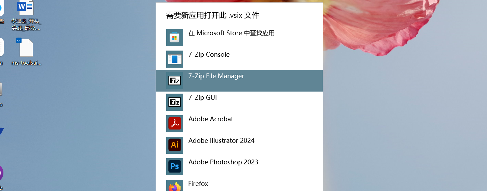
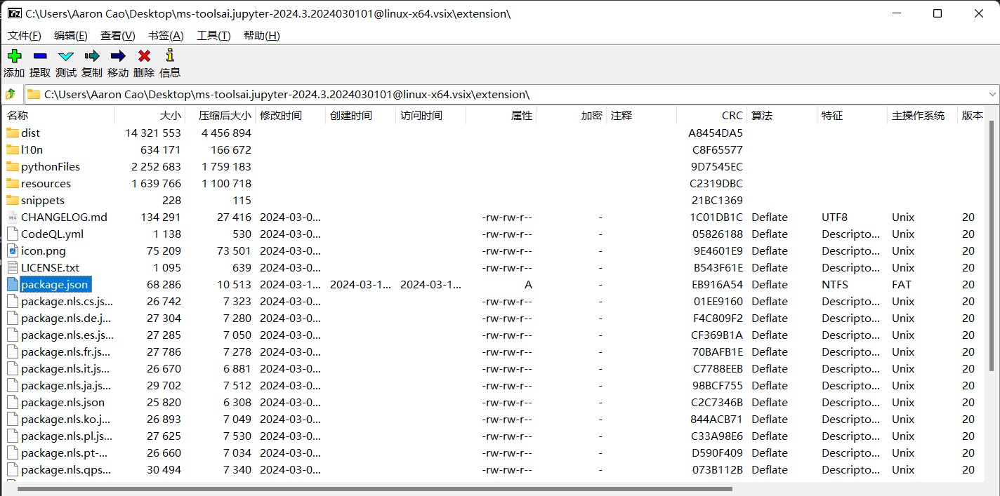
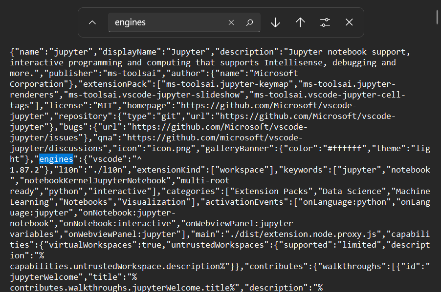
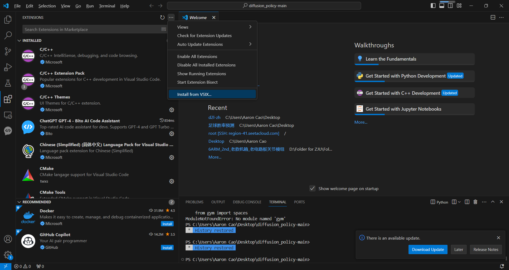

# 解决离线安装 VSCode Extension 时版本不匹配问题

## 1. 下载 `.vsix`格式的安装包

### VSCode 下载链接：

`https://marketplace.visualstudio.com/`

---

## 2. 使用压缩软件打开安装包

>  *注意不要解压安装包后再打开文件，要在压缩包文件管理软件中直接打开修改*

---

## 3. 修改配置文件中对 VSCode 版本的设置

### 在打开的`package.json`中搜索`engines`

### 此处使用`Ubuntu`上的 VSCode，版本`1.87.2`，如上图修改并应用修改，保存。

### 重新使用`Install from VSIX`离线安装插件即可。

